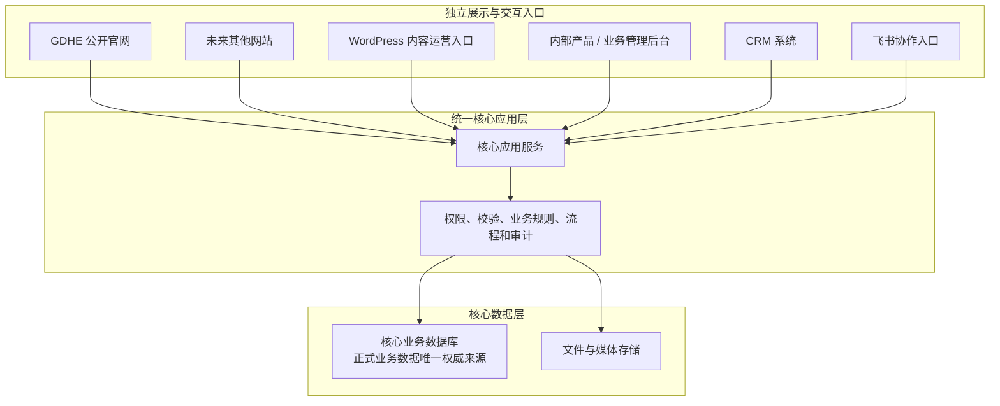

# Project Contract

schema_version: DPG-3

## 一、本文档的作用

本文档是 GDHE 项目长期目标、系统边界和数据权威的治理文件。

本文档不是数据库设计、API 设计、目录结构设计、迁移实施方案、任务清单，也不是对具体框架、组件或部署方式的批准。任何尚未经过专项讨论的技术细节，都必须在对应任务开始时重新分析、提出方案并获得确认。

当专项实施文档与本文档存在差异时：

- 本文档决定长期方向和不可突破的系统边界；
- 已经运行或已经验收的能力在迁移完成前继续保留；
- 专项实施文档只约束其已批准范围，不能自动扩大为新的长期目标；
- 差异必须通过后续专项任务逐步解决，不能据此直接重构或删除现有实现。

## 二、项目身份与长期目标

GDHE 项目不再只被定义为一个 Headless WordPress 企业官网。

长期目标是建设一个企业数字平台，能够支持：

1. 当前 GDHE 公开官网；
2. 未来其他品牌或业务网站；
3. WordPress 内容运营入口；
4. 产品和业务管理后台；
5. CRM 系统；
6. 飞书任务、通知和流程协作；
7. 未来其他内部或外部系统。

这些入口可以拥有各自独立的前端、域名、权限和部署方式，但共享统一的核心业务能力和正式业务数据。

当前 GDHE 公开官网继续服务海外 B2B 客户，核心转化是询价，不是在线支付、结账或自动形成最终商业报价。

## 三、已经确认的核心边界

### 1. 正式业务数据必须有唯一权威来源

系统应存在一个核心数据层，作为正式业务数据的最终权威来源。

核心业务数据包括但不限于：

- 产品、型号和规格；
- 客户和联系人；
- 询价和 CRM 数据；
- 业务状态、任务和流程结果；
- 正式对外发布的数据；
- 系统审计和外部系统映射。

同一项业务数据不能同时由 WordPress、飞书和核心数据库分别维护权威版本。其他系统可以保存缓存、编辑草稿、展示副本或同步副本，但不能成为同一业务字段的第二个权威来源。

### 2. 正式业务读写必须经过统一核心应用服务

公开官网、未来网站、WordPress、内部管理后台、CRM、飞书、未来移动端或经销商系统，都不应直接连接或修改核心数据库。

所有正式业务读写应经过统一的核心应用服务。核心应用服务负责：

- 权限判断；
- 数据校验；
- 业务规则；
- 状态流转；
- 数据一致性；
- 审计；
- 对外系统集成。

核心应用服务的一级技术基线见第十节；TASK-038 的本地 Catalog 接口采用 REST + OpenAPI，具体字段与权限通过 Manifest 的 `catalog_api_contract` 发现；其他领域模块和接口仍需专项确定。

### 3. 系统允许存在多个独立前端

不同用途不需要全部建立在 WordPress 或同一个前端项目上。目标入口至少可以包括：

```text
GDHE 公开官网
未来其他品牌或业务网站
WordPress 内容运营入口
内部产品与业务管理后台
CRM 系统
飞书协作入口
其他未来入口
```

这些入口可以面向不同用户、使用不同域名和页面框架、具备不同权限并独立迭代。它们共享的是核心应用服务和正式业务数据，而不是同一个前端代码库。

### 4. WordPress 只承担内容运营职责

保留 WordPress 的主要原因是让非技术人员能够搭建页面、维护网站内容并使用成熟的编辑体验。

WordPress 的长期定位是一个需要内部账号登录的内容运营和页面编辑入口。它不应被定义为：

- 整个系统的核心后端；
- 产品主数据中心；
- CRM 或询价数据库；
- 工作流最终状态的保存位置；
- 所有系统必须依赖的统一前端。

WordPress 草稿与正式发布数据的逻辑职责已由第十二节确认；交换、预览和发布的具体机制仍需单独设计。WordPress 自身需要的技术存储不构成核心业务数据的第二个权威来源。

### 5. CRM 是独立的内部业务入口

未来 CRM 面向销售人员和管理人员，通过账号和权限登录。它可以负责客户、联系人、询价、跟进、商机、销售任务和团队管理，但必须通过核心应用服务操作正式业务数据，不能直接连接核心数据库。

CRM 的详细功能、权限体系、数据表和工作流尚未冻结。

### 6. 飞书承担协作能力，而不是核心数据能力

飞书继续用于任务传达、消息通知、到期提醒、催办、员工协作、流程交互和移动端处理。

飞书是核心系统之外的协作和交互渠道，不是核心业务数据库。核心业务状态和流程结果不能只保存在飞书中。

飞书与核心系统的同步方式、允许编辑的范围、是否继续使用飞书工作流以及哪些能力未来需要自建，均需以后专项讨论。

## 四、目标架构边界示意



该图只表达系统边界。除第十节已经冻结的一级技术选型外，它不决定 API 协议、发布复制方式、Worker、消息队列、具体进程拆分或部署拓扑。

## 五、当前尚未确定的事项

以下内容即使在过去的讨论、文档或示例中出现，也不能被视为已经批准。

### 技术选型

- TASK-038 Catalog 之外的 API 形式与路径（本地 Catalog 已采用 REST + OpenAPI）；
- 身份认证方案；
- 权限模型；
- 后台任务、消息队列、Redis 和搜索方案；
- 文件存储；
- 部署平台和运行拓扑；
- 代码目录迁移。

Drizzle ORM / Drizzle Kit 已经 TASK-036 真实 PostgreSQL 验证并验收，第一阶段采用；精确版本与正式数据库资产由 Manifest 的 `core_database_architecture`、`core_database_source` 路由记录，不再作为待选型项。

### WordPress 集成

- WordPress 草稿、修订和正式页面版本的物理存储方式；
- WordPress 向 Core Application 发布正式页面版本的具体机制；
- 页面区块、产品嵌入、预览和发布失败恢复方式；
- WordPress 用户是否接入统一身份系统。

### 飞书集成

- 是否继续使用多维表格、审批或任务；
- 哪些字段允许从飞书修改；
- 单向同步还是受控双向同步；
- 哪些工作流保留在飞书，哪些逐步由自建能力替代。

### 核心业务系统

- 超出 TASK-037 Site / Manual Track Catalog 七表范围的数据表、字段和关系；
- 产品主数据后续物理模型与约束；产品逻辑边界见第十一节，当前七表实现见 `core_database_architecture`；
- CRM 范围；
- 工作流状态；
- 角色和权限；
- API 路径；
- 后台页面结构；
- 多网站数据模型。

### 迁移方式

- 当前 WordPress 产品模型如何处理；
- 当前 `/resolve` 等接口是否保留；
- 当前 RFQ MySQL 如何迁移；
- 是否调整现有目录；
- 新旧系统并行多久；
- 产品、内容、询价和 CRM 的迁移顺序。

## 六、当前实现与长期边界的主要差异

以下差异只用于确定后续讨论范围，不授权当前任务实施迁移：

1. 历史 Headless WordPress 专项架构仍记录 WordPress 运行时数据源和飞书产品主数据权威的旧方向；该文档已标记为 `SUPERSEDED / HISTORICAL` 并撤出 Manifest 当前架构权威。现有运行代码仍需后续渐进迁移。
2. 当前公开内容、产品 DTO 和多项只读 API 由 WordPress 与 `gdhe-site` 提供；长期内容编辑与正式发布职责已由 TASK-034/035 确认，但 WordPress Bridge、Publication 和 Core Public API 尚未实现。
3. 当前 RFQ 已有独立本地 MySQL Schema 和 Next.js 本地 intake 纵向切片，但它仍是隔离的本地实现，不等同于已经确定的统一核心应用服务或核心数据库。
4. 当前前端、WordPress、RFQ 合同、测试和本地验证能力继续有效；在替代方案验收前不得删除或宣称失效。
5. 独立 CRM、统一内部管理后台以及核心系统与飞书之间的正式集成尚未建立。

## 七、Codex 执行约束

### 1. 架构目标不是实施授权

不得因为本文档提到核心应用服务、核心数据库、独立 CRM 或多前端，就自行创建服务、创建数据库表、引入框架、迁移代码、删除旧实现、建立 CRM 页面、修改 WordPress 数据流、接入飞书或改造部署结构。

只有当前任务明确要求实施，并且相关细节已经确认后，才允许执行。

### 2. 未确认事项不得自行补全

遇到会实质改变架构或产品结果的未确定问题时，应先说明当前问题和现有实现，提出可选方案、影响和推荐，再明确指出需要用户决定的事项。推荐方案不能自动视为批准方案。

### 3. 每个任务只实施当次确认范围

未来目标只能作为兼容性约束，不能作为扩大任务范围的理由。一个任务没有明确批准的数据库、CRM、WordPress、RFQ、飞书、目录或部署改造，不得顺便实施。

### 4. 示例不等于需求

本文档或其他资料中的模块名、表名、API、技术栈、数据流和目录示例，如果没有经过专项任务确认，只能用于解释，不能原样实施。

### 5. 保留现有能力并渐进迁移

任何替换都必须遵循：

```text
现状核查
→ 新方案讨论
→ 最小验证
→ 验收
→ 渐进迁移
→ 确认替代
→ 再处理旧实现
```

在替代能力正式验收前，不得删除现有有效功能。

## 八、后续应分别讨论的主题

后续专项任务应按实际业务优先级分别讨论，不能由本文档自动启动：

1. 核心业务数据范围与权威字段划分；
2. NestJS 核心应用服务的模块边界和 API 设计；
3. PostgreSQL 数据模型、迁移工具和现有数据迁移边界；
4. WordPress 内容草稿、预览、发布与正式数据交换机制；
5. 产品主数据物理模型、媒体、多网站发布及现有数据迁移方式；
6. RFQ 从当前本地实现迁移到核心系统的方式；
7. CRM 功能范围、权限和工作流；
8. 飞书同步、通知、任务和流程交互边界；
9. 身份认证、审计、文件存储和部署架构；
10. 新旧系统并行、验收和回退策略。

## 九、持续授权边界

- 真实客户数据、生产内容发布、生产部署和外部系统写入继续需要单独明确授权。
- 新的付费服务、插件、基础设施和商业集成必须先获得批准。
- 测试数据、本地演示和候选架构不得被表述为生产事实或已批准实施。

## 十、一级技术选型基线

本章只记录已经确认的最上层技术方向，不构成创建项目、安装依赖、设计数据表、迁移代码或改变现有运行方式的授权。

### 已确认的一级技术选型

#### 1. 主要开发语言采用 TypeScript

公开网站、未来其他网站、内部管理系统和核心应用服务，统一以 TypeScript 为主要开发语言。

WordPress 自定义插件可以继续使用 PHP，但 PHP 不作为 GDHE 核心平台的主要开发语言。

#### 2. Web 前端采用 Next.js

当前公开官网、未来其他网站、内部管理后台和 CRM 原则上采用 Next.js。

不同用途的前端可以作为独立应用开发和部署，不要求全部合并到同一个 Next.js 项目中。

#### 3. 统一核心应用服务采用 Node.js、TypeScript 和 NestJS

NestJS 核心应用服务负责：

- 核心业务规则；
- 数据校验；
- 权限判断；
- 状态流转；
- 数据一致性；
- 数据库事务；
- 审计；
- 前端接口；
- 外部系统集成。

公开网站、内部后台、CRM、WordPress 和飞书都不能分别建立自己的核心业务规则。

#### 4. 第一阶段采用模块化单体架构

核心应用第一阶段采用 Modular Monolith，不拆分微服务。业务模块可以保持明确边界，但仍运行在统一核心应用服务和统一核心数据库之上。

未经专项讨论，不得自行引入：

- 微服务；
- 每个模块独立数据库；
- 分布式事务；
- Kafka；
- Kubernetes；
- Event Sourcing；
- 复杂 API Gateway。

#### 5. 核心业务数据库采用 PostgreSQL

产品、客户、询价、CRM、工作流、任务、审计、正式发布数据和外部系统映射等正式业务数据，以 PostgreSQL 为最终权威来源。

第一阶段逻辑骨架已由 TASK-035 确认，Drizzle 工具链已由 TASK-036 验证。TASK-037 只实施 Site / Manual Track Catalog 七表，其他表、业务接口和部署机制仍由后续专项任务确定。

#### 6. WordPress 和 Gutenberg 继续保留

WordPress 作为独立的内部内容运营和页面编辑入口，解决非技术人员搭建页面和维护网站内容的问题。

WordPress 不是整个系统的核心后端，也不是产品、询价、CRM 和工作流数据的最终权威来源。WordPress 可以继续使用其自身需要的 MySQL 或 MariaDB。

WordPress 如何与核心应用服务交换、预览和发布内容，需要后续专项讨论。

### 硬性技术边界

- 所有前端都不能直接连接 PostgreSQL；
- WordPress 不能直接修改核心数据库；
- 飞书不能直接修改核心数据库；
- 正式业务读写必须经过 NestJS 核心应用服务；
- Next.js 不承载所有系统共享的核心业务规则；
- 第一阶段不采用微服务；
- 现有代码采用渐进迁移，不得直接推倒重建；
- 在替代能力完成验证前，不得删除当前有效实现。

### 尚未确认的实施事项

以下事项仍需专项确认；已经由 TASK-035/036/037 明确的数据库骨架、工具和七表范围不重复列为待定：

- TASK-038 Catalog 之外的 API 形式和路径；
- 七表之外的数据库物理表和字段；
- 身份认证；
- 权限模型；
- WordPress 发布机制；
- 飞书同步机制；
- CRM 详细功能；
- 工作流设计；
- 后台任务和消息队列；
- Redis；
- 文件存储；
- 部署平台；
- 代码目录迁移。

## 十一、产品主数据长期边界

本节冻结产品主数据的逻辑业务边界，不构成物理数据库、API、ORM、迁移或业务代码实施授权。详细逻辑模型由 Manifest 路由的 `product_master_logical_model` 权威文件记录。

1. GDHE 公开网站、未来 ERP、CRM 和其他系统共用统一产品主数据域，但不得把全部产品及规格压入一张包含大量空字段的万能结构。
2. `Product` 表示跨系统共用的产品款式、型号和公共身份；官网产品卡片、详情页及 WordPress 页面绑定 `Product`。
3. `Product Spec` 表示 ERP、报价、生产及未来库存能够唯一识别的具体成品规格。`Article Number` 属于 `Product Spec`，不属于 `Product`；`Product Spec` 不得重复保存整套 `Product` 公共信息。
4. 产品主数据逻辑上必须区分公共 `Product`、公共 `Product Spec`、共享字典及 `Product Allowed Configuration`、品类专属工程规格和 Spec Detail。后两者只按真实产品族需要建立，不提前为所有配件创建结构。
5. `Product Allowed Configuration` 表示某个 `Product` 原则上允许客户或销售使用的配置；`Product Spec` 表示真实 `Article Number` 已对应的具体配置。二者不得混用，也不得预生成全部理论组合。
6. 原始 RFQ 保存客户当时选择的 `Product`、公开配置、数量和要求，不强制解析 `Product Spec` 或 `Article Number`。销售确认后的内部规格和报价规格必须另行保存，不得覆盖客户原始提交。
7. WordPress 绑定 `Product`，负责页面、营销文案、布局、图片和 SEO，不管理 `Product Spec`、`Article Number`、报价、生产或库存。ERP 使用 `Product Spec` 和 `Article Number`；WordPress 与 ERP 并行引用统一产品主数据，不建立在彼此的数据表之上。
8. 现有 Product Configuration、`articleNumberOptions`、颜色/长度选择、Custom Length、Quote Line 和 RFQ 快照只作为字段需求与迁移资产参考。当前按 Product、颜色和长度直接解析 `Article Number` 的方式不是长期模型；在替代能力完成验证前，现有实现仍须保留。

## 十二、首条公开产品纵向链路长期边界

本节冻结 Catalog → WordPress、Core Publication → Next.js、Next.js → RFQ 的系统职责和业务语义，不冻结最终 API 路径、字段名、Schema、数据库结构、插件、页面组件或迁移实现。完整逻辑合同由 Manifest 路由的 `public_product_flow_contract` 权威文件记录。

1. 每个 WordPress 产品详情页第一阶段绑定一个稳定的 Primary Core Product ID。型号、名称、Slug、WordPress Post ID 和 Article Number 均不得作为正式系统关联键。
2. Catalog 负责 Product 事实、公开允许配置、合法产品关系和基准技术资产，并只向 WordPress 提供面向 CMS 编辑的受控只读投影。WordPress 负责营销内容、页面结构、展示覆盖、SEO、营销媒体、草稿、修订和正式发布版本，不维护 Product Spec、Article Number 或产品事实副本。
3. WordPress 只能决定合法产品事实和关系的展示方式、子集与顺序，不能修改事实、创建不存在的兼容关系或把展示覆盖写回 Catalog。
4. Core Application 负责把 WordPress 的正式页面版本与 Catalog 当前公开有效的 Product 事实组合成完整、受控、版本化的 Published Product Page View。页面版本不复制整套产品事实；页面内容回滚不回滚 Catalog 当前事实。
5. 正式生产环境的 Next.js 产品页面只读取 Core Public API，不直接读取 WordPress REST、WordPress 数据库、Catalog 数据库或其他内部数据库，也不消费 WordPress Post、Gutenberg、ACF/SCF 或插件原始结构。
6. 公开页面合同只包含批准公开的页面、产品事实、配置、关系、媒体和 SEO 数据，不包含 Product Spec、Article Number、轨道重量、成本、报价、库存、生产、ERP 状态、内部备注或 WordPress 内部 ID。
7. 公开 RFQ 保存客户实际看到并提交的原始需求。轨道行第一阶段以 Core Product ID、标准颜色 ID 或定制颜色描述、标准或定制长度、正整数数量及 Commercial Requirements 表达；长度业务语义统一为整数毫米。
8. 公开 RFQ 不提交重量、Product Spec ID 或 Article Number。Core Application 必须重新验证 Product、颜色、长度、数量单位和 Commercial Requirements，并由服务端生成可信提交快照；浏览器名称、型号和显示文本不能直接成为可信事实。
9. 客户原始 RFQ 与销售后续确认的重量、Product Spec、Article Number 和报价规格分别保存。后续确认或客户变更不得覆盖客户最初提交的事实。
10. 多产品 Basket 采用整张 RFQ 原子提交，并保留现有幂等、并发、跨重启恢复、公开回执和精确 Basket 清理语义。只有 Core Application 确认整张 RFQ 保存成功后，Next.js 才清理对应提交内容。
11. Catalog 管理产品基准技术资产；WordPress 管理营销媒体和页面编排；Core Application 生成不暴露内部来源的公开媒体投影。
12. 当前 WordPress 直读、Article Number 预解析、Product Configuration、Quote Basket 和 RFQ 实现继续作为迁移资产保留。本节不授权修改或删除现有代码；替代能力须经后续专项设计、渐进迁移和验收。

## 十三、核心数据库长期硬边界

本节只冻结第一阶段数据库架构中不可违反的高层边界。完整范围、长期关系、演进原则和未决事项由 Manifest 路由的 `core_database_architecture` 权威文件记录；本节不构成数据库、Drizzle Schema 或 Migration 实施授权。

1. PostgreSQL 是 GDHE 正式核心业务数据库。第一阶段数据域限定为 Site、Catalog、Publication 和 RFQ；所有正式业务读写仍须经过 NestJS 核心应用服务。
2. Product 与未来 Product Spec 必须分层。Product 表示跨系统公共产品身份；Article Number 属于 Product Spec。不同产品族使用各自的工程规格和 Spec Detail 结构，不建立万能规格表、EAV 或万能技术 JSONB。
3. 第一阶段只建立当前 Manual Track 公开纵向链路实际需要的 Product、分类、颜色、轨道公开事实和标准长度结构。Product Spec、轨道重量规格、布带规格、CRM、ERP、Audit 和 Integration 结构明确后置。
4. WordPress 保存内容草稿和编辑状态；PostgreSQL Publication 保存 Core Application 接受的不可变正式页面版本、当前正式版本和当前公开路径。正式 Page Version 与当前公开 Catalog 事实组合成公开页面视图。
5. 原始 RFQ 与销售后续确认的重量、Product Spec、Article Number 和报价结果必须分别保存。RFQ 多行及服务端快照和可重放回执采用整张事务原子写入，不允许部分保存。
6. JSONB 仅用于受控的正式页面文档、RFQ Line 历史快照和幂等公开响应；关系型产品身份、规格、颜色、长度、Article Number、报价、库存、生产和成本不得用 JSONB 代替。
7. 正式数据库结构变更只能通过版本控制中的已审查 SQL Migration。共享开发、Staging 和 Production 不以 `drizzle-kit push` 代替 Migration，也不在普通应用启动时自动执行 Migration。
8. Drizzle 已通过 TASK-036 最小 PostgreSQL 兼容性验证并获验收，第一阶段采用。ORM 或代码生成能力不足时，应以自定义 SQL 保留正确约束，不得为迁就工具削弱数据库模型；Probe 的演示字段、唯一性、ID 生成和延迟外键不自动成为正式设计。
9. Migration Role 与 Application Role 必须分离；Next.js、WordPress 和飞书不得持有 PostgreSQL 凭据。Database Row 必须经过 Domain Projection 或 Adapter 后才能形成公开 API DTO。
10. 不引入通用 Repository/Base CRUD、全表通用 Soft Delete 或机械级联删除。约束、删除动作、状态和索引必须由真实业务生命周期与查询路径决定。
11. 现有 MySQL RFQ、WordPress、Next.js、Product Configuration、Quote Basket 和 RFQ 合同继续作为迁移资产保留，在替代能力通过专项验证和验收前不得删除。
