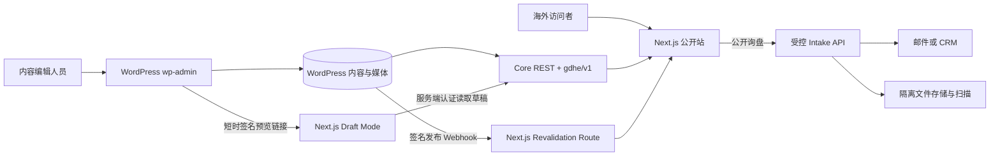
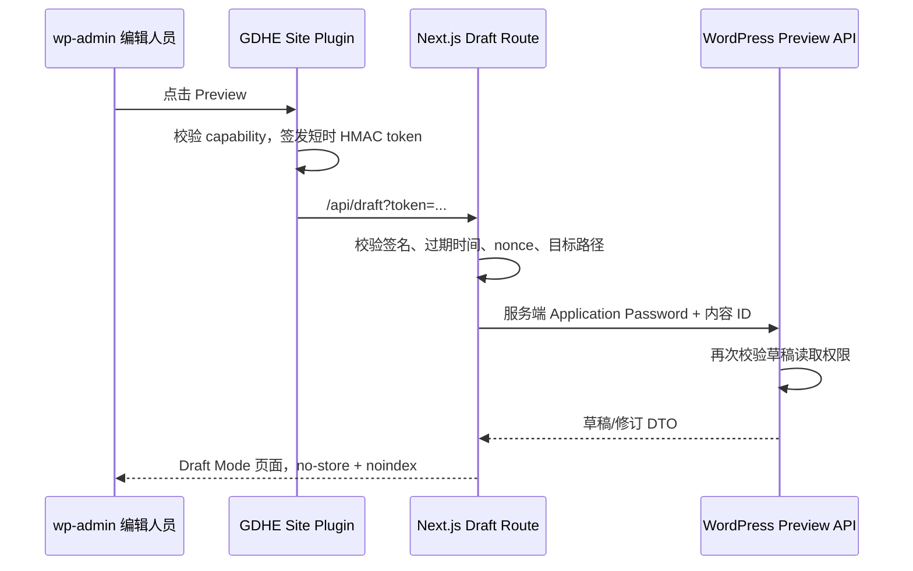

# GDHE Headless WordPress + Next.js 架构契约

status: accepted-core-with-TASK-012-roadmap-revision-pending-acceptance
date: 2026-07-26
scope: accepted architecture contract plus implemented CMS foundation and proposed roadmap revision
supersedes: `docs/reference-site-analysis.md` 中 WordPress + Elementor 的实施建议
authority: `PROJECT/CONSTRAINTS.md`、ADR-001、ADR-002、ADR-003、ADR-004、已随 TASK-004 接受的 ADR-005、本契约与待 TASK-012 验收的 ADR-006

## 0. 决策摘要

| 领域 | 决策 |
|---|---|
| 公开前端 | Next.js App Router + TypeScript；版本在初始化任务中重新核实并锁定当时稳定补丁版 |
| 内容后台 | 现有 WordPress；`wp-admin` 是唯一最终内容管理后台 |
| 页面渲染 | 已发布营销内容采用静态生成/ISR；搜索、预览和其他请求态页面动态渲染 |
| 数据 API | **REST-first 受控组合**：WordPress 核心 REST + GDHE 自有 `/gdhe/v1` 归一化端点；本阶段不采用 WPGraphQL |
| 内容模型 | CPT/Taxonomy 由 GDHE Site Plugin 注册；SCF 提供字段运行时；版本化 JSON 是字段事实源；模块集合受控 |
| 多语言 | 当前只启用英语 `/`；隔离 PoC 只可在第 14.6.1 节进入门满足后由独立任务授权，生产采购、公开路由和逐语种建设还必须通过第 14.6.2 节成熟度门 |
| SEO 编辑 | 推荐 Yoast SEO，编辑人员在 `wp-admin` 维护 SEO 数据 |
| SEO 输出 | Next.js 是公开 HTML 的唯一输出权威；生成 canonical、hreflang、OG、Schema、Sitemap、robots |
| 预览 | WordPress 生成短时签名预览链接；Next.js Draft Mode；草稿数据只经服务端认证读取 |
| 缓存刷新 | WordPress 发布事件发送 HMAC 签名 Webhook；Next.js 按内容、路径、语言和集合标签失效 |
| 媒体 | WordPress Media Library 只存公开营销媒体；Next.js 统一图片组件和严格远程域名白名单 |
| 询盘与 CAD | 通过独立受控 intake API 和隔离对象存储；机密文件不得进入公开 Media Library |
| 飞书多维表格 | 结构化产品主数据权威：型号、Article Number、规格和可用状态从飞书单向流向网站侧；询价也写入飞书，由业务员报价 |
| 参考边界 | 复用 RapidDirect 的公开信息架构和体验模式，不复制其源码、主题、品牌资产或文案 |

本契约最初由 TASK-002 接受。TASK-003 已建立最小 Next.js 基础；TASK-004 已实现英语 CMS/SCF 最小基础。未明确标记为“已实现”的 DTO、预览、Webhook、多语言、SEO、询盘和部署能力仍只是后续契约，不得据此宣称已完成。

## 1. 证据快照与版本口径

### 1.1 本地只读现场

2026-07-22 只读核验结果：

- WordPress Core：`7.0.2`，与 WordPress.org 当前安全稳定版一致。
- PHP CLI：`8.3.32`。
- MySQL Server：`8.4.10`；当前数据库由服务器报告为 `gdhe`，项目命名仍记作 `GDHE`。
- WordPress 活跃插件：无；Akismet 与 Hello Dolly 均未启用。
- 活跃主题：Twenty Twenty-Five；公开站不会使用它渲染最终页面。
- Next.js 尚未初始化；官方文档在本次核验时处于 `16.2.x` 稳定线，精确补丁号须在初始化当天重新查询并锁定。

版本号会变化，因此本契约只冻结能力和边界，不把当前补丁号写成长期硬约束。

TASK-004 于 2026-07-23 形成的实施快照：

- WordPress 7.0.2、PHP 8.3.32、MySQL 8.4.10 保持可用；Core checksum 和数据库检查通过。
- 官方 Secure Custom Fields 6.9.2 已核验、安装并激活；插件 checksum 通过。包内 `readme.txt` 的 `Stable tag: 6.9.1` 与官方 API/主插件头 6.9.2 不一致，作为上游元数据问题保留。
- GDHE 自有 `gdhe-site` 0.1.1 已激活；Schema 为 1.0.0，当前仅启用 `en`。Round 1 窄修订已加入停用时精确撤销 capability 矩阵，以及匿名/`view` 投影对非公开 relationship/media 引用的 fail-closed 过滤。
- ACF、ACF Pro、WPML、ACFML、Polylang 与 WPGraphQL 均未安装。
- 实施和回滚证据位于 `TASKS/ARTIFACTS/TASK-004/` 与 `docs/cms/`；第三方运行时和数据库备份保持 Git 忽略。

### 1.2 证据原则

- 核心能力优先采用 Next.js、WordPress、插件厂商和 Google Search 官方资料。
- 插件价格、兼容版本、许可证、部署平台能力均属于时间敏感信息，进入安装任务前必须重新核实。
- RapidDirect 研究是视觉和信息架构证据，不是我方技术实现事实源。

## 2. 系统边界



### 2.1 责任矩阵

| 能力 | WordPress / `wp-admin` | Next.js | 外部/基础设施 |
|---|---|---|---|
| 营销内容、译文、SEO、公开媒体、页面编排与页面发布状态 | 唯一编辑权威 | 只读消费与公开渲染 | — |
| 型号、Article Number、规格、产品可用状态 | 可查看的只读镜像；禁止作为编辑权威 | 只读消费 | 飞书多维表格是唯一编辑权威 |
| 页面布局和组件代码 | 保存结构化模块数据 | 唯一渲染权威 | — |
| URL 解析与语言切换映射 | 提供已发布路由和译文关系 | 规范化、路由和输出 | CDN 仅缓存 |
| SEO 文案 | 编辑与存储 | 生成最终标签和 JSON-LD | 搜索引擎消费 |
| 草稿预览 | 发起、鉴权、提供草稿 | Draft Mode 渲染 | — |
| 缓存失效 | 发送签名事件 | 校验并失效缓存 | 多实例时共享标签状态 |
| 公开表单 | 可保存将来的内部线索记录，但不是上传通道 | 表单 UI 与 BFF 入口 | 邮件/CRM、对象存储、扫描 |
| 用户账号 | WordPress 编辑账号 | 无公开客户账号 | 身份服务仅在未来需求中引入 |

不可形成第二套内容后台或第二份内容数据库。前端不得通过 Elementor、主题模板或 WordPress 页面 HTML 来决定最终公共布局。

## 3. 前端契约

### 3.1 路由模式

公开内容使用单一、可解析的 catch-all 内容入口，固定系统路由优先：

```text
src/app/
├── [[...segments]]/page.tsx       # 已发布 CMS 内容解析
├── search/page.tsx                # 动态搜索
├── api/draft/route.ts             # 开启预览
├── api/draft/disable/route.ts      # 退出预览
├── api/revalidate/route.ts        # 发布 Webhook
├── sitemap.ts                     # 公开路由清单
├── robots.ts
├── not-found.tsx
└── error.tsx
```

以上是未来公开站的目标目录输入，不代表紧接 TASK-012 的下一任务，也不表示这些文件已经创建；实际顺序服从第 14 节。

路由解析规则：

1. 如果首段是八个非英语 locale 之一，则该段决定语言；否则使用英语。
2. 英语不允许公开 `/en/` 副本；命中时永久重定向到无前缀 URL。
3. `zh-CN` 保留已确认大小写；错误大小写只重定向到唯一规范形式。
4. 内容 slug 可按语言独立维护；每个译文拥有自己的完整 `publicPath`。
5. 公共内容 URL 使用尾斜杠；大小写、重复斜杠和无尾斜杠变体一次永久归一。
6. 路由解析不到内容、译文未发布或类型不匹配时返回真实 404，不回退首页。

### 3.2 渲染策略

| 页面/请求 | 策略 | 初始兜底刷新 | 说明 |
|---|---|---:|---|
| 首页、About、Contact 壳层 | ISR | 24 小时 | 发布 Webhook 为主，时间刷新防止事件丢失 |
| Service、Industry、Material、Finish、Case、Blog 详情 | ISR | 24 小时 | 首批关键页可构建时生成，其余首次访问生成 |
| 服务/行业/资料库/博客列表与分页 | ISR | 1 小时 | 发布、撤回、分类变化时同时失效集合标签 |
| 站内搜索 | 动态 SSR / `no-store` | 不缓存个性化查询 | 查询参数不生成 canonical 内容页 |
| 草稿预览 | 动态 / `no-store` | 无 | 必须处于 Draft Mode 且服务端认证 |
| 表单 POST | 动态 Route Handler/BFF | 无 | 与内容渲染缓存完全隔离 |
| 404 | 动态解析后稳定 404 | — | `noindex`；不得 200 soft-404 |

当 WordPress 在 ISR 刷新时暂时不可用，保留最后一次成功生成的页面并记录错误；新部署在构建期无法取得必需内容时应失败，不用空内容覆盖线上版本。

### 3.3 Server / Client 边界

- 页面、布局、CMS 请求、Metadata 和 JSON-LD 默认使用 Server Components。
- Mega Menu、移动导航、Tabs、Accordion、Carousel、文件选择等确需状态或浏览器 API 的小组件才使用 Client Components。
- CMS 地址、预览凭据、Webhook Secret 和 API 凭据仅存在于 server-only 数据层，禁止进入 `NEXT_PUBLIC_*`。
- 组件只消费归一化 DTO，不直接依赖 WordPress、SCF、未来多语言插件或 Yoast 的原始响应形状。

### 3.4 建议模块边界

```text
src/
├── app/                         # 路由和 Metadata 文件
├── components/
│   ├── layout/                  # Header、Mega Menu、Footer、LanguageSwitcher
│   ├── modules/                 # CMS 可编排内容模块
│   ├── templates/               # 页面类型组合
│   └── ui/                      # Button、Card、Image、Tabs、Accordion 等
├── lib/
│   ├── cms/                     # client、adapter、schemas、cache tags
│   ├── i18n/                    # locale、路径、dir、语言切换
│   ├── seo/                     # metadata、hreflang、JSON-LD、sitemap
│   ├── inquiry/                 # 后续表单 BFF 边界
│   └── security/                # 签名、重放保护、输入验证
└── types/                       # 公开 DTO 与模块判别联合
```

## 4. WordPress 内容模型

### 4.1 注册方式

- CPT、Taxonomy、REST 端点、权限和发布 Hook 必须由 `gdhe-site` 自有插件注册。
- 不在主题、WordPress Core 或第三方插件中写项目逻辑。
- 不使用只存数据库、无法审查的 CPT UI 配置作为生产事实源。
- 所有公共 CPT 设置 `show_in_rest => true`；非公开内部类型通过自有端点和 capability 控制。

### 4.2 内容类型

| 类型 | WordPress 实体 | 核心内容 | 主要关系 |
|---|---|---|---|
| 通用页面 | 原生 `page` | 首页、About、Contact、法律页、活动落地页 | 模块、CTA、相关内容 |
| 服务 | `service` CPT | 能力说明、规格、公差、工艺、FAQ | Materials、Finishes、Industries、Cases |
| 行业 | `industry` CPT | 行业痛点、开发阶段、应用 | Services、Materials、Finishes、Cases |
| 材料 | `material` CPT | 性能、适用工艺、规格、应用 | Services、Finishes、Cases |
| 表面处理（Surface Finishes） | `surface_finish` CPT | 描述、适用材料/工艺、参数 | Materials、Services、Cases |
| 案例 | `case_study` CPT | 挑战、方案、过程、结果、获授权媒体 | Services、Industries、Materials |
| 客户评价（Testimonials） | `testimonial` CPT | 引语、姓名/职务、来源和使用授权 | 可选关联 Service/Case |
| 博客 | 原生 `post` | 长文、作者、分类、日期、封面 | Services、Materials、Cases |
| 当前英语站点设置 | 非公开 `site_settings` CPT | Header CTA、Footer、联系信息、社交链接 | 当前仅 `en`；未来多语言任务再定义译文关联 |

建议 Taxonomy：

- `service_family`：Machining、Molding、Fabrication、3D Printing 等。
- `manufacturing_process`：材料/处理可适用的工艺。
- `material_family`：Metal、Plastic、Composite 等。
- `finish_family`：Coating、Plating、Mechanical、Heat Treatment 等。
- 博客继续使用原生 Category/Tag；只有真实筛选需求出现时才增加新 taxonomy。

### 4.3 共享字段

TASK-004 已实现并冻结的英语 Schema 1.0.0 共享字段为：

- `schema_version`
- `template_key`
- `summary`
- Hero：eyebrow、H1、lead、媒体引用、主/次 CTA
- 关系字段：Services、Industries、Materials、Finishes、Cases
- 受控内容模块 `modules[]`

标题、slug、摘要、发布/修改时间和作者仍由 WordPress Core 字段提供。以下字段属于后续 Schema/DTO 任务，不得当作 TASK-004 已实现：`locale`、不可变 `translation_group_id`、SEO 编辑数据、Breadcrumb Hub、来源/授权说明和 Posts 关系。启用多语言前必须用新 Schema 与迁移说明加入语言字段，不能在前端临时推导。

正文原则：

- 博客长文使用受控的原生 Block Editor 内容，前端只支持已列入测试清单的块和安全 HTML。
- 营销页、服务页和资料页使用结构化字段/模块，不把整页 Elementor HTML、任意短代码或内联脚本作为 API 内容。
- 规格表、FAQ、步骤、评价等使用结构化数组，不能塞进一个不可验证的 WYSIWYG 字段。

### 4.4 有限页面模块

英语 Schema 1.0.0 当前只允许：

`hero`、`rich_text`、`card_grid`、`split_media`、`accordion`、`data_table`、`cta_banner`。

`stats`、`logo_strip`、`process_steps`、`tabs`、`testimonial_slider` 与 `resource_cards` 仍是未来候选，不属于当前 Schema。增加、删除或重命名模块必须升级 Schema 并提供迁移/回滚说明。

每个公开模块最终必须有稳定 `type`、instance `id`、`schemaVersion` 和明确字段；禁止在 `wp-admin` 输入 CSS、JavaScript、任意类名或组件路径。TASK-004 已冻结 layout 名称和顶层 Schema，但尚未形成最终页面 DTO；instance ID/version 与 `data_table` 的结构化行列校验必须在前端首次消费前由后续 DTO/fixture 任务完成，不能由组件索引或自由文本隐式代替。

### 4.5 SCF 字段层决策

ADR-005 以已验证的 WordPress.org **Secure Custom Fields（SCF）** 替代 ADR-004 的 ACF Pro 实施建议。TASK-004 固定安装包为 6.9.2，并验证 Repeater、Flexible Content、关系、图片、链接、revision、autosave、preview 和 REST 投影所需的当前能力。约束如下：

- 固定业务字段优先使用固定 Field Group；Flexible Content 仅用于七种已列模块，不做无限页面生成器。
- CPT、Taxonomy、capability 和公开投影仍由 `gdhe-site` 注册；SCF 只提供字段运行时和编辑体验。
- `gdhe-site/config/field-groups.v1.json` 是可重建的版本化事实源；SCF UI 不得产生未同步的生产字段漂移。
- 匿名响应不直接暴露 SCF 的通用 `acf` 容器或 Core `meta` 容器，只返回显式 allowlist 的 `gdhe` 投影。
- 字段删除、改名或响应形状变化需要新 Schema、迁移和回滚说明。
- SCF 只能从 WordPress 官方渠道安装；固定包、checksum、兼容性和备份门在每次更新任务中重新核实。不得修改 SCF 源码或将第三方运行时纳入 Git。
- ACF 与 ACF Pro 当前不采购、不安装，也不得与 SCF 并装。

## 5. API 契约

### 5.1 REST 与 WPGraphQL 结论

| 评估项 | WordPress REST | WPGraphQL |
|---|---|---|
| WordPress Core 内建 | 是 | 否，需要插件 |
| 未来语言/译文响应 | WPML/ACFML 与 GDHE REST adapter 待 PoC | 需要 WPML GraphQL 等额外插件链 |
| Yoast 官方 Headless API（未来候选） | 直接提供 REST JSON | 需要额外 GraphQL 适配 |
| SCF | 当前通过 GDHE allowlisted REST 投影实测 | GraphQL 兼容链尚未 PoC |
| 深层关系一次查询 | 需归一化端点 | 强项 |
| 缓存与发布事件映射 | 资源/路径语义直接 | 需维护查询与实体依赖映射 |
| 当前项目复杂度 | 足够且依赖更少 | 现阶段收益不足以抵消插件链 |

frontend 与 wordpress_cms Lane 均提出了“WPGraphQL 主读取 + REST 窄用途”的有力备选，理由是深层关系、字段选择和类型生成；localization_seo Lane 则指出它会把多语言方案推向 WPML GraphQL，并增加 ACF、多语言与 SEO 扩展的兼容链。本契约没有忽略该分歧，完整裁决见 `TASKS/ARTIFACTS/TASK-002/EVIDENCE_SYNTHESIS.md`。

**决定：**首期采用 WordPress REST，不安装 WPGraphQL。TASK-004 已实测 Core REST、GDHE allowlisted 字段投影和 `/gdhe/v1/schema`；WPML/ACFML、Yoast 与完整 DTO 尚未安装或实现。数据访问层保留 adapter 边界；只有在真实页面查询出现无法通过批量 REST、`_fields`、`_embed` 或有限 `/gdhe/v1` 合理解决的可测瓶颈，或未来业务明确需要 WPML GraphQL 工作流时，才用新 ADR 重新评估 WPGraphQL。不得在组件中临时混入第二套数据协议。

TASK-002 冻结的量化复评门继续有效，但它不再构成“下一阶段 API fixture 任务”。只有第 14 节阶段 2 或阶段 5 的真实产品消费证据表明 REST-first 出现可测瓶颈时，才用同一组真实产品分类/系列、产品详情、下载/关系页面比较 REST 与候选 GraphQL。测试从与 CMS 同部署区域运行，保留 WordPress 正常 object cache、绕过 Next.js 数据缓存；每个代表 fixture 预热后测量 200 次、并发 20。以下任一条件成立时，必须**提出一个独立授权的 GraphQL PoC 与新 ADR 候选**，不得自动执行或直接在生产引入：

- 四个 fixture 中至少两个在聚合后仍需要超过 2 个串行 CMS origin 请求；
- 任一 fixture 的 CMS 数据获取 p95 超过 500 ms，或上游错误率超过 1%；
- 四个 fixture 中至少两个在使用 `_fields` 和归一化后单页 JSON 仍超过 250 KB；
- 自有只读聚合增长为超过 5 个端点，或出现 3 个及以上模板专属查询图。

这些数值是协议比较门，不是尚未验证的生产 SLA。只有 WPGraphQL 对同一 fixture 显著改善触发指标，且 ACF、多语言、SEO、预览、权限和许可证 PoC 同时通过，才可用新 ADR 替换 REST-first。

### 5.2 端点层级

0. 当前已实现的 GDHE 合同边界
   - TASK-007 已交付 REST API `1`、Content Schema `3.0.0`、Module Schema `1.0.0` 与匿名只读 `GET /wp-json/gdhe/v1/schema`。
   - TASK-007 已交付并冻结 `GET /resolve`、`GET /collection/{type}`、`GET /navigation` 和 `GET /route-manifest`；它们只返回通过 Schema 3、模板配对、路径唯一性和公开资格校验的已发布内容。
   - TASK-014 在不改变上述合同的前提下新增匿名只读 `GET /product-cards` 与独立 ProductCard Schema `1.0.0`。一次 collection 响应提供完整卡片 DTO；公开资格先于 filter/total/pagination，前端不得逐卡调用 `/resolve`。
   - 当前公开类型为原生 `page`、原生 `post`、`product`、`market`、`reference`、`support_article` 和 `download`；`site_settings` 仍无公开 Core REST route。
   - Core REST 的 GDHE 投影继续使用 allowlist；通用 `acf`、原始 SCF/postmeta 和内部数据库形状不是公开合同。
1. 核心 `/wp-json/wp/v2/*`
   - 简单 CPT/Taxonomy 集合、媒体、作者等标准资源。
   - 通过 `_fields` 限制响应，避免前端取得无关字段。
2. 未来 WPML/ACFML adapter（未实现）
   - 语言筛选、译文关系和字段翻译行为必须由第 14.6.1 节进入门后的独立 PoC 固定；不能预设未验证的 REST 形状。
3. 未来 Yoast REST（未实现）
   - 如后续安装，读取 `yoast_head_json` 的编辑结果；不使用其只读 API 写数据。
4. 未来 Preview 读取边界（未实现）
   - Preview endpoint、签名入口和认证草稿/修订读取均尚未交付；候选 `GET /preview/{id}` 形状必须由阶段 3 的独立任务、Schema 3 preview DTO、最小权限和 Draft Mode 合同共同冻结。

公共端点只返回 `publish` 内容。草稿、私有内容、内部备注、用户邮件、插件配置和原始机密 meta 不得出现在匿名响应。

### 5.3 归一化 DTO 示例

```ts
type Locale = 'en' | 'fr' | 'de' | 'es' | 'zh-CN' | 'ar' | 'hi' | 'ja' | 'pt'

interface MediaReference {
  attachmentId: number
  url: string
  mimeType: string
  width: number
  height: number
  alt: string
  caption?: string
  decorative: boolean
}

interface ContentEnvelope {
  schemaVersion: '1.0'
  id: number
  type: 'page' | 'service' | 'industry' | 'material' | 'surface_finish' | 'case_study' | 'post'
  templateKey: string
  locale: Locale
  translationGroupId: string
  publicPath: string
  title: string
  excerpt?: string
  publishedAt: string
  modifiedAt: string
  featuredMedia?: MediaReference
  hero?: HeroModule
  modules: ContentModule[]
  relations: Record<string, ContentReference[]>
  translations: Partial<Record<Locale, { publicPath: string }>>
  seo: SeoDocument
}
```

这段 TypeScript 仍只是 TASK-002 的历史契约示例，不是当前 Schema 3 消费事实。TASK-007 已交付版本化 PHP/JSON 合同与代表性 Fixture，TASK-008～011 已交付当前 `/resolve` 前端闭包和最小消费者；TASK-014 已增加独立 ProductCard CMS/API 合同，但尚未建立前端 snapshot、Validator、Transport、Adapter 或可见卡片页面。`SeoDocument` 归一化合同与前端 ProductCard consumer 仍须分别另立任务。

### 5.4 错误和版本边界

| HTTP | 语义 |
|---:|---|
| 400 | locale、path、筛选或 schema 参数非法 |
| 401 | 未提供或无效的预览身份 |
| 403 | 身份存在但无查看该草稿的 capability |
| 404 | 路由不存在、内容未发布或译文不可公开 |
| 409 | 路由/译文关系冲突，主要用于受控管理接口 |
| 429 | 超出速率限制 |
| 502/503 | CMS 或下游服务暂时不可用；前端应保留最后成功缓存 |

- `/gdhe/v1` 保持向后兼容；破坏性响应变化进入 `/gdhe/v2`。
- 响应提供 `schemaVersion`、`Last-Modified`/ETag（适用时）和可追踪 request ID。
- 前端在边界做运行时校验；遇到未知必需模块或不兼容 schema 时记录错误并让该页失败到受控错误态，不能悄悄渲染错误内容。

## 6. 九语言发布契约

| 内容语言 | 公共前缀 | HTML `lang` | 方向 |
|---|---|---|---|
| 英语 | `/` | `en` | LTR |
| 法语 | `/fr/` | `fr` | LTR |
| 德语 | `/de/` | `de` | LTR |
| 西班牙语 | `/es/` | `es` | LTR |
| 简体中文 | `/zh-CN/` | `zh-CN` | LTR |
| 阿拉伯语 | `/ar/` | `ar` | RTL |
| 印地语 | `/hi/` | `hi` | LTR |
| 日语 | `/ja/` | `ja` | LTR |
| 葡萄牙语 | `/pt/` | `pt` | LTR |

### 6.1 插件与编辑流程

当前阶段只启用英语，不安装 WPML、ACFML、Polylang 或机器翻译插件，不创建任何非英语内容或公开入口。ADR-002 的九语言范围是未来发布目标，不是当前运行状态。

未来只有第 14.6.1 节的 PoC 进入门满足后，才可由独立任务评估 **WPML Multilingual CMS + ACFML**；TASK-012 不授权安装或采购。PoC 至少覆盖 English/French/Arabic 的产品、分类、下载和关系 fixture，以及 SCF 字段兼容、独立发布/撤回、RTL、REST 译文关系、权限、preview、缓存失效、升级和回滚。SCF + WPML/ACFML 兼容性是 PoC 必须产出的结论，不是授权 PoC 前预先存在的证据。只有 PoC PASS 且第 14.6.2 节生产成熟度门全部满足，才可另行确认生产许可证、公开语言路由或逐语种建设。生产英语站的连续监控时长仍是风险证据，但不再以固定三个月作为唯一启动条件。WPML 与其他多语言插件不得并装，WPGraphQL 也不因选择 WPML 自动启用。

稳定译文组 ID 不依赖未来多语言插件未承诺的内部结构，也不使用会随内容变化的最小 post ID。多语言 PoC 中由 GDHE Site Plugin 注册受保护 meta `_gdhe_translation_group_uuid`：

- 首个语言实体创建时生成 UUID v4；创建或关联 sibling 时复制同一值；匿名 Core REST 不直接暴露该 meta。
- `/gdhe/v1` 只在所有插件关联 sibling 拥有同一 UUID 且 locale 唯一时返回 `translationGroupId`；不一致时 fail closed 并记录治理错误。
- 删除英语源文不改变其他 sibling 的 UUID；拆组、合组或重连必须由有权限的显式迁移操作完成，同时失效旧组、新组、路由、hreflang 和 Sitemap。
- 既有内容迁移时一次性生成并持久化 UUID；前端不得从 slug、标题、URL 或当前 sibling 集合计算组 ID。

编辑流程：

1. 英语是源文，先创建并完成基本字段。
2. 目标语言通过已验证的 WPML 流程创建为独立内容实体，不与英语共享 `post_status`。
3. 初始复制仅用于建立结构；译文文本、slug、SEO、OG 图和关系均可独立编辑。
4. 译文由 Draft → Pending Review → Publish 独立推进；没有自动发布联动。
5. 不配置 DeepL 或其他机器翻译服务；机器翻译不是项目正式流程。
6. 英语更新不会自动覆盖已发布译文；编辑界面应提示译文可能过期，但是否重新发布由人工决定。

SCF + ACFML 的候选翻译行为（必须由未来 PoC 证实）：

- 文本与模块子字段使用独立翻译或 Translate Once，避免源文后续覆盖译文。
- 图片的 attachment ID 可 Copy Once 作为译文起点；同一媒体引用内的 `alt`、caption 和 decorative 标记使用 Translate Once，并由目标语言编辑人员独立复核。编辑人员之后可以按语言替换 attachment ID。
- 数字和不可变内部 ID 可 Copy Once；除明确不可变技术值外不持续同步。
- 除明确的不可变技术值外，不使用持续 Synchronize。
- 关系字段优先映射到目标语言已发布实体；目标关系不存在时为空并提示，而不是链接回英语内容。

### 6.2 语言切换

以下规则只在未来多语言任务启用；当前英语站不渲染语言切换入口，也不构造其他语言 URL。

- API 返回当前翻译组中**已发布**版本的 `locale → publicPath` 映射。
- 切换器只显示可公开译文；缺失/草稿译文默认隐藏，不显示会跳首页的假链接。
- 当前语言始终有自链接状态；阿拉伯语切换后 `<html dir="rtl">`。
- 不根据 IP 或 `Accept-Language` 强制重定向。未来可以提供非阻断语言建议，但不得改变爬虫 canonical。
- 直接访问未发布译文返回 404；从 Sitemap、hreflang、语言切换和站内搜索全部排除。

### 6.3 RTL

- 用 CSS logical properties（如 inline/block start/end），不能把 left/right 写死为布局语义。
- 图标箭头、步骤方向、Carousel、面包屑、表格滚动和 Mega Menu 展开方向逐组件验证。
- 电话、邮箱、代码、尺寸和文件名等局部 LTR 内容使用明确 `dir` 隔离。
- 1440、1024、768、390 px 均用真实阿拉伯语内容验收，不只切换 `dir` 属性。

## 7. SEO 契约

### 7.1 权威边界

- Yoast SEO 仍是未来编辑层候选，尚未安装；如后续采用，它提供 `wp-admin` 编辑、SEO/可读性提示和 REST 中的 `yoast_head_json`。
- Next.js 不直接注入 Yoast 的 `yoast_head` HTML blob，以免输出 CMS 域名、重复标签或未经验证的脚本。
- Next.js 从归一化 `SeoDocument` 生成最终 Metadata；canonical、公开 URL、hreflang 和 Schema 必须以公开站域名为准。
- 公开 HTML 只能有一套 canonical、robots、OG 和 JSON-LD 输出权威。

Yoast Free 足以作为首期候选；Premium 只有在重定向管理、内部链接等具体收益被确认后才采购，不能因“参考站使用”自动购买。

### 7.2 每页输出

- 唯一 Title、Meta Description、单一 H1。
- 自引用 canonical；各语言不 canonical 到英语。
- Open Graph（OG）/Twitter 标题、描述、图片和 locale。
- 可见 Breadcrumb 与 `BreadcrumbList` 保持一致。
- `html lang` 与阿拉伯语 `dir`。
- 索引策略：公开已发布页面默认 `index,follow`；预览、搜索结果、Staging 和内部页面 `noindex`。

### 7.3 hreflang

当前只启用英语，因此不输出非英语 alternate 或未发布语言的 hreflang。以下规则在未来真实译文发布后启用：

- 每个已发布译文页面输出相同的、双向闭合的 alternate 集合，包含自身。
- `x-default` 指向该翻译组的英语 URL；英语是已确认的默认和源语言。
- 只输出已发布译文；不为缺失语言构造 URL。
- 使用完整绝对 HTTPS URL；`zh-CN` 保留地区代码，其余使用已确认通用语言代码。
- HTML head 是首要实现；Sitemap 可以同时携带语言 alternates，但必须由同一 route manifest 生成，避免两套数据源。

### 7.4 Schema

| 模板 | JSON-LD |
|---|---|
| 全站/首页 | `Organization`、`WebSite` |
| 所有层级页 | `BreadcrumbList` |
| 服务/行业 | `Service` + 对应 `WebPage` |
| 博客 | `Article`、`Person`、`ImageObject` |
| 案例 | `Article` 或 `CreativeWork`，按实际内容选择 |
| 材料/表面处理 | `WebPage`；只有真实满足定义时再增加专业类型 |

- 不输出虚构评分、不可见 FAQ、伪造价格或未经核验的认证。
- `Product`、`AggregateRating`、`Review` 只有业务语义和页面可见证据都成立时才能使用。
- FAQ 内容可以保留语义化 HTML；是否输出 `FAQPage` 在实施时依据当时搜索政策重新验证。

### 7.5 Sitemap、robots 与 URL 生命周期

- Next.js 根据 `route-manifest` 生成公开 Sitemap，只包含 canonical、已发布、可索引 URL。
- 可按内容类型拆分 Sitemap；规模未达到阈值前不做无意义分片。
- `robots.txt` 指向公开 Sitemap；Staging 使用身份保护和 `noindex`，不能只依赖 robots 阻止索引。
- slug 改名或迁移必须记录旧路径并产生单跳永久重定向。
- 撤回页面从 Sitemap/hreflang 移除并返回 404；只有明确永久删除策略时使用 410。

## 8. 预览契约



安全要求：

- Token 有内容 ID、locale、目标路径、签发/过期时间和一次性 nonce，建议有效期不超过 5 分钟。
- WordPress Application Password 绑定最小权限技术账号，只经 HTTPS 和服务端使用，可单独撤销。
- 预览 URL 不携带 WordPress 用户密码，不把认证信息写入日志、Analytics 或 Referer。
- Draft Mode cookie 为 HttpOnly、Secure、SameSite；提供明确退出预览入口。
- 预览响应 `private, no-store` 并 `noindex`；任何 CDN 不得缓存。

## 9. 发布 Webhook 与缓存

### 9.1 事件

以下变化触发失效事件：发布、更新、撤回、删除、slug/父级变更、译文关系变更、Taxonomy/关系字段变更、菜单和站点设置变更。

示例负载：

```json
{
  "eventId": "uuid",
  "event": "content.published",
  "occurredAt": "2026-07-22T00:00:00Z",
  "content": { "id": 123, "type": "service", "locale": "de" },
  "translationGroupId": "2d4f3e7e-5ae0-4a7d-a796-1e2bd0cb5b67",
  "oldPath": "/de/alter-slug/",
  "newPath": "/de/neuer-slug/",
  "tags": ["content:service:123", "collection:service:de", "translation:2d4f3e7e-5ae0-4a7d-a796-1e2bd0cb5b67"]
}
```

HTTP Header 包含 key ID、时间戳和请求体 HMAC。Next.js 校验时间窗口、常量时间签名和 `eventId` 重放记录后，才调用缓存 API。

### 9.2 标签

| 标签 | 用途 |
|---|---|
| `content:{type}:{id}` | 当前内容数据 |
| `route:{locale}:{pathHash}` | 当前公开路径 |
| `translation:{groupId}` | 全部语言映射与 hreflang |
| `collection:{type}:{locale}` | 列表、分页和筛选 |
| `nav:{locale}` | Header/Mega Menu/Footer 导航 |
| `settings:{locale}` | 当前语言全局设置 |
| `sitemap` | route manifest 与 Sitemap |

外部 Webhook 需要内容立即过期时，按当前 Next.js 官方契约使用 `revalidateTag(tag, { expire: 0 })`，并对旧/新 path 使用 `revalidatePath`；具体 API 在初始化时按锁定版本复核。

### 9.3 可靠性

- WordPress 记录发送结果、状态码、重试次数和 request ID；失败采用有上限的退避重试。
- Webhook 处理必须幂等；相同 `eventId` 重复到达不产生异常。
- 24 小时/1 小时 ISR 时间窗是事件丢失的最终兜底，不替代告警。
- 多实例自托管时使用共享 cache/tag 协调；否则一个实例失效而其他实例继续返回旧内容。
- 若前置 CDN 单独缓存 HTML，必须同步 purge；首期优先只使用部署平台/Next.js 的单一 HTML 缓存权威。

## 10. 媒体契约

- WordPress Media Library 只存可公开的品牌、工厂、服务、案例和文章媒体。当前英语阶段不安装多语言媒体模块；未来 WPML/ACFML PoC 必须在首批译文/媒体导入前冻结 attachment 与字段翻译策略，不得在内容建立后静默切换。
- attachment 只作为二进制、MIME、宽高、尺寸、credit 和授权信息的事实源。WordPress attachment 的全局 `alt_text` 只可作为编辑提示，不能直接成为公开多语言 alt 的 fallback。
- 每次公开媒体使用都保存于当前语言内容实体的结构化 `MediaReference`：attachment ID、`alt`、caption、decorative。它是**唯一**本地化模型，不再同时维护 attachment sibling 方案。
- ACF Image/Gallery 关系的 attachment ID 可 Copy Once 作为初始选择；`alt` 与 caption 子字段 Translate Once。目标译文发布前必须人工复核，源文更新不得覆盖它们。
- 非装饰图必须有当前语言、当前上下文的非空 `alt`；装饰图必须 `decorative=true` 且 `alt=""`。必需字段不满足时阻止发布；已存在的异常公开数据由 API schema fail closed，不能回退英语 alt、文件名或 attachment 全局 alt。
- 如果图片内含文字或市场内容，未来目标语言内容实体直接选择另一 attachment；不预设两个物理文件必须建立某个插件的媒体译文关系。
- API 用当前内容引用与 attachment 二进制元数据组合返回 `MediaReference`。同一 attachment 在不同页面、语言或上下文可拥有不同 alt，这是设计目标而非重复数据错误。
- Next.js 公共图片组件统一处理比例、`sizes`、优先级、懒加载和错误占位；远程图片仅允许精确 HTTPS 主机/路径模式。
- 视频使用封面和延迟加载；大视频优先外部流媒体/CDN，WordPress 只存元数据和授权封面。
- 图片生成 WebP/AVIF 的具体链路在部署任务决定；不得同时堆叠多个互相改写 URL 的图片插件。
- 机密 CAD、报价附件、客户图纸和含个人数据的文件不得进入 Media Library，也不得取得公开 URL。

## 11. 询盘、文件、邮件与 CRM 边界

当前只实现了浏览器本地的 Quote Basket 集合层；最终询盘提交、联系信息和飞书写入仍只冻结边界：

1. GDHE 官网是 B2B 询价站，不是面向消费者的在线商城。访客选择所需型号、规格、配件及其他必要选项后提交 quotation request；当前业务范围不提供购物车结算、在线订单确认或在线支付。
   - 英语站统一主询价 CTA 使用 `Request a Quote`。正常在售产品的同一主转化路径不得混用 `Ask for Quotation` 或 `Get a Quote`；停产产品继续使用已确认的 `Contact Us for Replacement`。
   - 正常在售产品的配置级动作使用 `Add to Quote`，将当前公开规格/选项和数量加入 `Quote Basket`；客户可继续浏览并添加其他产品。集合层最终主动作使用 `Request a Quote`，未来在统一步骤填写联系信息并一次提交。产品 CTA 不直接触发单产品表单提交，也不代表在线下单。
   - TASK-022 的浏览器 Quote Basket 只使用完整公开配置作为合并身份，不保存 Article Number、内部 Product/Media UUID 或 WordPress/飞书身份。同一公开产品路径且长度、颜色、包装、Logo、保护方式和数量单位等全部配置相同时，重复添加累加到同一行；任一配置不同则保留独立行。未来服务端必须把每行当作不可信输入，重新解析 Article Number 与完整配置后才能一次提交。
   - TASK-023 使用固定匿名 `GET /gdhe/v1/related-product-cards?locale=en&schema=1.0.0&source_path=<canonical path>` 读取型号级推荐。产品详情只发起一次完整集合请求，且不为每张卡片调用 `/resolve`；响应经过精确九份 Schema 的运行时校验、真实 opaque wrapper 和深冻结 server DTO 后才可消费。
   - RelatedProductCard 的公开 Client 投影移除 Product、Media、taxonomy UUID、时间戳、原始动作枚举和诊断；未批准的远程媒体在进入 React 前被拒绝。生产 HTTPS 媒体来源与 Next Image allowlist 仍是部署门。推荐集合失败只隐藏推荐模块，不能移除已经 ready 的产品详情或配置器。
   - TASK-023 的 Quote Basket `2.0.0` 是闭合的 `configured_product | catalog_accessory` 公开联合结构，沿用 v1 的存储键、30 天 TTL、256 KiB 上限和同源 newer-wins 规则。合法 v1 数据只在内存中迁移；下一次有效修改才写回 v2。目录配件行不得伪造轨道长度、颜色或包装。
   - 每一个加入 quotation request 的产品或配件 RFQ 行项目都必须填写数量；缺少数量的行项目不能作为完整询价提交。数量只能是大于零的整数，最小值为 `1`；空值、`0`、负数和小数均无效。未来实现必须在浏览器交互层与服务端 intake 校验层同时执行该约束。
   - 公开 RFQ 数量单位按产品类别固定：轨道按“支”，布带和线珠按“卷”，电机、遥控器及其他配件按“个”。飞书产品主数据为每个 Article Number 保存长度换算字段；飞书报价系统接收 Article Number 和客户数量后读取该字段，将轨道、布带和线珠换算为总米数，配件继续按个计算，并根据包装方式折算各类包装件数。总米数、包装件数和计算公式属于飞书报价系统责任，不要求访客在网页端输入，也不进入 WordPress、GDHE REST API 或 Next.js 的实现范围。系统统一使用 `Article Number`，不创建 `Part Number` 字段或别名。
2. 可独立询价的配件可以脱离主产品成为报价请求中的独立行；每个配件拥有独立 Article Number，并沿用全公司范围不重复的 Article Number 规则。公开页面身份按产品类型决定：同款、同型号、出厂配套的电机与遥控器共用一个组合产品页面；布带、transparent tape 和用户所称“线珠”等可独立表达的大类建立类型详情页；轨道封口、走珠、顶码、墙码等小型安装配件只在相关主产品区域展示。类型页承载其真实可订购规格，不为每个规格创建独立页面。
   - 电机与遥控器共用页面不等于共享库存身份：电机和遥控器分别保留自己的全局唯一 Article Number，API 和 RFQ 不创建额外组合 Article Number。页面需要同时表达两个部件身份，并允许客户只选电机、只选遥控器或同时选择两者；两个 RFQ 行项目分别填写数量且数量可以不同。
   - 所有上述附属产品统一使用“配件”业务角色，不建立“备件”或“套装成员”独立角色。配件通过可筛选的“配件类别”组织；当前示例为顶码、墙码、走珠、封口、布带和线珠。“配件类别”只负责分类和筛选，不决定是否建立独立详情页；页面身份继续沿用前述混合公开规则。用户已确认“强码”是“墙码”的笔误，数据中只允许规范类别“墙码”。
   - 配件类别基数为多对一：每个具体配件必须且只能关联一个配件类别，同一 Article Number 不得同时出现在多个配件类别中；一个配件类别可以包含多个配件。筛选结果按该唯一类别归属生成，不复制配件记录。
   - 配件不强制每个 Article Number 都有独立型号。布带按“型号 → 多个规格/Article Number”组织：型号由颜色与钉子材质共同决定；同一型号下，宽度、钉距和长度变化产生不同可订购规格及 Article Number。当前已知宽度为 30mm、45mm、60mm，钉距包括 125mm、145mm、165mm、170mm 及更多值，长度包括 30m、40m、50m、60m 等。封口、顶码、吊码、走珠等其他配件通常同时有型号和 Article Number，但不得据“通常”把型号设为所有配件的强制字段。
   - 线珠按“型号 → 珠距/卷长规格”组织，型号由颜色与具体珠型共同决定。当前珠型包括尚飞大方珠系列的单扣、双扣和大圆扣，以及用户所称佳丽斯中方珠/珠系列的单扣佳丽斯中方珠、双扣佳丽斯中方珠和小圆扣佳丽斯珠。常见珠距为 6cm、6.6cm、7cm、8cm、10.2cm；10.2cm 目前只记录为双扣常见规格，不设排他规则。珠距和卷长共同确定具体规格；任一变化都产生独立 Article Number，但不改变型号。
3. 浏览器向同源 Next.js intake Route Handler 提交表单，不直接 POST WordPress 公共 REST。
4. 文本字段做 schema 校验、长度限制、反垃圾、速率限制、Origin/CSRF 防护和隐私同意记录。
5. 文件先取得短时预签名上传地址，写入隔离对象存储的 quarantine 区。
6. 服务端校验扩展名、MIME、文件签名和大小，重命名对象并执行病毒/沙箱扫描；扫描通过后才可供内部人员访问。
7. 邮件/CRM 通知异步发送；失败可重试，不能让浏览器假成功。
8. 如需在 `wp-admin` 查看线索，可在后续任务创建非公开 `gdhe_inquiry` 类型，只保存最小化元数据、处理状态和短时签名文件引用；文件本体仍在隔离存储。
9. 用户已确认 quotation request 最终要在指定飞书多维表格中新增记录，由业务员在飞书完成报价；实现前必须读取真实 Base、表、字段、关联、权限和幂等键，不得凭口述猜 ID 或字段。
10. 报价请求的精确字段、数量规则、CTA 英文标签、飞书写入失败/重试/去重/状态回传、保留期限、允许格式/容量、邮件和扫描供应商均需要继续逐项确认。

## 12. 安全、权限与隐私

- 编辑角色按最小权限划分：Administrator 管系统；Editor/语言编辑只管理获授权内容和语言。
- 当前没有语言专属 capability。未来 WPML/ACFML PoC 必须验证最小权限的语言/翻译角色；机器翻译或自动发布 capability 不授予。
- 匿名 API 只读已发布字段；预览端点用 `current_user_can`/等效 capability，而不是只检查“已登录”。
- 所有 WordPress 输入先验证再清理，输出按上下文延迟转义；富文本使用明确 HTML allowlist。
- Preview、Webhook、Intake 使用不同 secret 和撤销机制；所有 secret 通过环境变量/主机 secret store 管理。
- CMS、Staging 和 Production 使用独立数据库、密钥和域名；备份加密并定期恢复演练。
- `wp-admin` 强制 HTTPS、2FA、最小账号、更新策略和 WAF；XML-RPC 等不需要入口按验证结果关闭或限制。
- 日志不得记录密码、Application Password、HMAC、完整 CAD URL 或敏感表单正文；request ID 用于关联。

## 13. 部署形态

建议域名边界：

```text
www.example.com        Next.js 公开站
cms.example.com        WordPress / wp-admin / 受控 REST
assets.example.com     可选公开媒体 CDN
uploads.example.com    私有上传服务，不公开列目录
```

实际域名和部署商未确认，不写死在代码契约。无论选择托管平台还是自托管：

- 必须支持 App Router、SSR、ISR、Draft Mode、Route Handlers 和按需失效，不能使用纯静态导出。
- 多实例部署必须有共享缓存和 tag 协调，或选择原生提供这一能力的平台。
- WordPress 与公开站可以独立发布和回滚；API schema 先向后兼容，再发布前端消费者。
- Staging 使用单独 CMS/数据快照、身份保护和 `noindex`；不能连接生产编辑库做破坏性测试。
- 健康检查至少覆盖前端、CMS REST、Webhook 最近成功时间和预览链路。

## 14. 后续实施顺序

本节是后续实施顺序的单一权威。它替代 TASK-005 对“全局壳层 → 首页 → 页面模板 → 后期 SEO/Preview/cache”的尚未执行顺序，但不改写 TASK-005 的合同、测试和交接边界。以下均是候选阶段；只有用户创建并确认对应任务后才可执行。

任务状态以 `TASKS/BOARD.md` 为当前视图，代码交付以 Git commit 与远端 ancestry 为事实，`PROJECT/STATE.md` 只记录当前总体状态和唯一下一步；本节不复制每个任务的完整历史。

### 14.1 保留的交付基线

TASK-001 至 TASK-013 全部保留，不回退、不重做，也不以路线重排为由扩张其既有范围：

| 任务 | 保留的交付事实 |
|---|---|
| TASK-001～TASK-006 | Git/GitHub、Headless 架构、Next.js 基础、英语 CMS/SCF 基础、API/前端边界和治理基线 |
| TASK-007 | Schema 3 产品模型、REST `resolve`/collection/navigation/route-manifest、Fixture、Golden、迁移与不可变交接；这是技术合同基线，不是经 GDHE 真实目录验证后的业务冻结 |
| TASK-008 | 前端本地 `/resolve` 合同快照和校验基线 |
| TASK-009 | server-only `/resolve` Transport、固定英语路径和错误语义 |
| TASK-010 | 运行时 Schema Validator 与调用方隔离的 validated wrapper |
| TASK-011 | 最小 Adapter、server-only 编排、技术集成页、真实 WordPress E2E 与强制清理 |
| TASK-012 | 真实产品边界、B2B 询价、飞书/WordPress 权威拆分、同步/媒体规则和产品优先路线图；当前记录仍是测试数据 |
| TASK-013 | 英语 IA、URL/canonical、CTA、ProductCard projection、最小 SEO 输入合同、测试候选和实施缺口 |

这些交付证明技术链路能够工作，并已冻结 TASK-013 范围内的英语 IA/URL/CTA 合同；它们不证明真实 GDHE 产品已适配、正式模板已完成、生产 Preview/cache/Webhook/Staging 已交付或多语言已启用。

TASK-014 当前在独立任务分支新增 `/product-cards` 与 ProductCard Schema `1.0.0` 的 CMS/API 合同、合成 Fixture 和验证证据；它尚未获得用户验收或 Git 交付，也不代表已有前端卡片、可见页面或生产目录。

### 14.2 内容与参考权威

- **飞书多维表格**是型号、Article Number、规格、可用状态等结构化产品主数据的唯一编辑权威；这些字段只允许单向流向网站侧，不在 WordPress 与飞书之间双向编辑。
- **WordPress `wp-admin`**是营销文案、SEO、公开媒体和页面编排的内容管理权威；它不取代飞书的结构化产品主数据权威。型号、Article Number、规格和可用状态在 `wp-admin` 中可以查看但只读，只能在飞书修改；Next.js 的具体读取路径仍待确认。
- **GDHE 真实资料**仍是下载、媒体、公司事实、文案和 CTA 业务流程的业务权威；资料不足时输出缺口，不用参考站内容补写。
- **产品型同业**只用于研究产品目录、系列、技术信息、下载和关系组织；不得复制品牌、型号、文案、图片或未授权资产。
- **RapidDirect**只用于信息节奏、信任表达、交互、响应式和转化模式；不得把其 Instant Quote、制造业 taxonomy 或页面内容机械移植到 GDHE。

### 14.3 Schema `19/16` 口径

- TASK-007 CMS 权威合同从 `page.v3`、`collection.v3`、`navigation`、`route-manifest` 和 `error` 五个根递归解析本地 `$ref`，得到 **19-file transitive Schema graph**。
- TASK-008 固定、TASK-010 编译、TASK-011 消费的是 `page.v3` + `error` 的前端本地 **16-Schema `/resolve` closure**。
- 两者共有同一组 16 个 `/resolve` 文件；CMS 图额外包含 `collection.v3.schema.json`、`navigation.schema.json` 和 `route-manifest.schema.json`。前端没有额外文件，差异不表示合同丢失，也不授权扩大当前前端消费者。
- TASK-014 ProductCard 是独立的 **8-file Schema closure**，不并入或改写上述 19/16 图。当前没有 ProductCard 前端 snapshot，因此不能把 8 个文件误称为前端已消费合同。

### 14.4 权威候选阶段

1. **英语站信息架构、真实目录与转化基线**
   - TASK-012 使用当前测试产品记录验证产品归组、规格、询价、媒体和关联同步等业务合同；这些记录不是最终生产目录，也不满足 10～20 个最终生产产品数据验收门。已确认的规则和未决生产数据门记录在 `TASKS/ARTIFACTS/TASK-012/REAL_PRODUCT_VALIDATION_GATE.md`。TASK-007 Schema 3 只能称为技术版本基线，不能称为真实产品业务模型已冻结。
   - 在正式批量导入、产品模板业务冻结和 Schema 业务冻结前，由用户或业务责任人提供并确认 10～20 个合法、可使用且来源可追溯的最终生产 GDHE 产品，覆盖普通手动轨道、电动轨道、医用轨道、S-fold/Ripplefold、罗马杆或特殊系统、顶装/墙装、多长度/颜色/表面处理、主产品/配件/备件/套装、电机/遥控/控制协议/兼容关系、多份安装说明/型录/技术图纸，以及停产/替代/升级型号。先做映射和压力验证，不直接批量导入。该门是后续阶段的强制进入条件，不是 TASK-012 路线图文档收口必须提前伪造的生产数据。
   - 已确认网站的主转化语义是 B2B quotation request：访客完成型号、规格、配件等选项后索取报价，不在线下单或支付。阶段内继续冻结一级/二级 IA、分类/系列、URL Map、slug/参数规则、页面类型、访客类型、精确 CTA 英文标签和辅助 CTA、公开 canonical origin、SEO 字段责任、内容责任和素材缺口。
   - 已确认飞书多维表格持续作为型号、Article Number、规格和可用状态的结构化产品主数据权威；WordPress 持续作为营销文案、SEO、公开媒体和页面编排的内容权威。产品主数据只允许从飞书单向流向网站侧，不采用默认双向同步；quotation request 写入飞书，由业务员在飞书报价。
   - 已确认型号、Article Number、规格和可用状态在 `wp-admin` 中显示为只读；产品介绍、SEO、公开图片和页面模块继续在 `wp-admin` 编辑。产品读取拓扑冻结为“飞书产品主数据 → 受控同步 → WordPress 只读镜像 → GDHE REST API → Next.js”：公开页面不在每次请求时直接读取飞书，现有 GDHE REST、Schema、Validator 和 Adapter 继续作为前端唯一内容边界。飞书必须提供显式的网站发布资格；只有被业务方标记为“允许发布”且 Article Number 有效的真实记录，才能进入网站同步范围，其他记录默认不进入。实施前仍须只读核对真实 Base/表/字段/关联/权限，并另行冻结字段映射、WordPress 发布审核、删除/停用、幂等、失败恢复、同步日志和最后成功数据保留策略。当前不授权连接或修改飞书。
   - 型号级产品关联关系同样只在飞书维护。飞书新增或删除关系后，下一次完整成功同步原子替换 WordPress 只读镜像中的关系集合，并经 GDHE REST API 自动更新对应产品详情页；WordPress 不重复编辑。同步失败保留最后一次成功关系集合。关系目标停用、撤销“允许发布”或 WordPress 未公开时，官网隐藏推荐且不生成无效链接，但保留飞书内部关系；目标重新满足资格并公开后自动恢复。
   - 发布审核采用分层生命周期：产品首次获得同步资格时只创建 WordPress 草稿，须由编辑人员完善并手动发布；已发布产品的普通飞书主数据更新通过校验后自动更新只读镜像并保持公开，不重复要求人工发布。Article Number、型号归属、产品记录删除或撤销网站发布资格属于重大变更，不得自动覆盖或下线，必须进入例外审核。任何校验失败都保留最后一次成功公开数据，且同步不得覆盖 WordPress 管理的营销文案、SEO、公开媒体和页面模块。
   - 停产产品不直接删除或自动下线：保留原 URL 和公开页面，显著标记 `Discontinued`；存在替代型号时展示替代产品链接；常规询价 CTA 改为 `Contact Us for Replacement`。替代/升级关系、停产生效时间和无替代型号时的内容规则仍须由真实样本与字段映射验证。
   - 产品与产品系列采用多对多关系，产品与应用场景也采用多对多关系。同一个产品可以出现在多个系列入口和多个应用场景页面，但只保留一个产品身份、一个 canonical 产品详情页和同一组 Article Number 规格，不因目录归属复制产品记录。
   - 技术参数按“分组、名称、值、单位、显示顺序”结构化保存，不将整张参数表降级为自由文本。第一阶段统一使用公制单位（如 `mm`、`cm`、`m`、`kg`），不按市场自动换算英制；未来如有真实市场需求，再由独立任务增加显示换算，并保留原始标准值。
   - 网站内容层只保存当前有效的型录、安装说明和技术图纸；当前文件记录类型、版本号、语言和生效日期，并可关联多个产品。失效旧版本不在 WordPress、飞书网站镜像或公开媒体中重复保存，由极空间独立归档；替换时网站关系切换到新文件并移除旧文件。极空间历史库不进入公开 API 或网站同步路径。
   - 成本、采购价、内部销售底价、利润/利润率、供应商信息、库存数据、客户专属报价、内部备注和业务审核记录只保存在飞书，不同步也不储存在网站系统。同步合同必须采用明确的公开字段白名单，这些敏感字段不得进入 WordPress、GDHE REST API、Next.js、公开缓存或应用日志。WordPress 可保留自身内容编辑修订历史，但不复制飞书业务审核记录。
   - 第一批公开产品字段白名单为：产品名称、型号、Article Number、真实可选规格、尺寸、颜色、表面处理、技术参数、安装方式、兼容关系、在售/停产状态、产品图片和当前有效资料。白名单只定义“允许公开”的字段范围；每条记录仍须通过飞书发布资格、数据校验和 WordPress 发布状态门。
   - 公开产品图片使用业务方在上传前制作完成的 `公开保护图`，包括可见水印、品牌标识或品牌底纹，并可包含型号和尺寸标注。WordPress 只管理和发布保护成品图；网站不自动生成水印或排版。内部无水印原图只保存在飞书、极空间等内部系统，不进入 WordPress、GDHE REST API、Next.js、隐藏字段、构建产物或公开缓存。
   - B2B 公开信息采用分层规则：MOQ 不特别展示，如内部需要只保留在飞书；整柜交期公开口径为“收到客户定金，并确认订单、包装和生产资料后，通常为 `30–40 天`”；包装材料选项按产品类别维护且每类相对固定；所有产品均可提供样品；公司可提供 OEM 和 ODM。包装、交期、样品和 OEM/ODM 由 WordPress 维护，不进入飞书产品主数据同步；当前已知产品类别的包装合同已确认，真实产品记录分配留待代表样本核对。
   - 用户提供的飞书截图确认轨道类包装相关来源标签为常规、纸盒、打字、套袋、大收缩膜和对扣。WordPress 对外说明分别表达防撞膜加尼龙带、泡沫膜外加纸盒、客户 Logo 印刷、单支 PP 膜热塑、大收缩膜整扎热塑、两根轨道对扣节省装柜空间。“打字”不得作为英文客户标签直接翻译。组合合同分为三个维度：基础包装必须在常规/纸盒/大收缩膜中三选一；Logo 印刷可选；保护/排列方式可以不选，选择时只能在套袋/对扣中二选一。Logo 印刷可与任一合法状态组合；真实轨道记录分配仍待代表产品核对。
   - 布带和用户所称“线珠”明确排除在上述轨道包装合同之外。它们的公开常规包装是纸箱包装；特殊“组合包装”只由业务员针对已有需求的客户提供，不在官网展示，也不进入公开 RFQ 自助选择。由于“常规包装”在轨道类表示防撞膜加尼龙带、在布带/线珠类表示纸箱，数据模型和 WordPress 配置必须使用类别限定的包装身份，不得共享一个全局“常规”枚举。
   - 同款、同型号且出厂配套的电机和遥控器采用固定纸箱包装。WordPress 只维护这一公开包装说明，API 和 RFQ 不输出包装选择集合；不得复用轨道或布带/线珠的包装选择合同。
   - 封口、走珠、顶码、墙码等小型相关配件同样固定使用纸箱包装。官网只在需要时展示固定说明，不输出包装选择集合，也不复用其他产品类别的包装合同。
   - 基于真实样本逐项确认：产品与变体边界；型号与 Article Number 的基数关系；配件是独立产品、关联附件还是套装成员；各产品实际所属系列和应用；各产品实际参数分组、名称、值、单位和顺序；文档版本、语言、失效和替代；公开字段与内部字段；MOQ、包装、交期、OEM/ODM 和样品等 B2B 字段；Excel 批量导入和更新是否需要及其业务键。
   - 形成 CMS Schema、normalized 产品卡片投影和 `SeoDocument` 缺口报告；未经证据和新任务确认不得改 Schema。禁止逐卡 `/resolve` 造成 N+1，也禁止前端读取原始 WordPress/SCF。
   - 在样本和上述规则获得业务确认、飞书/WordPress 权威拆分冻结、缺口报告完成且必要 Schema 修订另行验收前，不得把当前 Schema 标记为业务冻结；Header、URL、产品模板、技术 SEO 和后续真实内容保持阻塞。

   **TASK-013 英语 IA、URL、CTA、Card 与 SEO 最小合同冻结：**

   - 英语一级导航冻结为 `Products`、`Applications`、`Resources`、`About GDHE`、`Contact`，另设独立主按钮 `Request a Quote`。Products Mega Menu 分为 `Curtain Track Systems` 与 `Accessories`；具体已确认子类记录在 `TASKS/ARTIFACTS/TASK-013/IA_AND_PAGE_TYPE_MAP.md`。当前不渲染语言切换入口。
   - 产品 canonical 采用 `/products/{product-slug}/`，公开型号是 slug 主要来源，Article Number 不进入 URL。分类、系列和应用只提供发现入口；一个产品无论属于多少系列或应用，始终保留一个身份和一个 canonical。产品详情 Breadcrumb 固定使用显式保存的主分类，不根据访问入口或关系顺序猜测。
   - 正常多产品询价统一使用 `/request-a-quote/`；通用联系和停产替代咨询使用 `/contact/`。有详情页的复杂产品先进入详情完成已知选择，小配件若无独立详情页可以在目录/关联模块满足选择与数量要求后直接加入询价。网站不建立购物车、结账或支付。
   - 发布保护与询价资格分离：首次同步仍创建 WordPress 草稿并由编辑人员手动发布；缺少公开保护图和基本公开身份时不得公开。产品成功同步并在 WordPress 公开后，即使网页端规格或 Article Number 不能唯一解析，也可以提交 `Request a Quote`；询价携带稳定产品身份、公开型号、已知选项、数量和备注，Article Number 可为空并由业务员在飞书中后续解析。前端/API 不得猜测规格组合或 Article Number。
   - 产品卡片采用统一骨架：公开保护图、型号、英语名称、可选的 `wp-admin` 人工英语短摘要、最多三项分类专属关键参数、必要状态和已确认动作。卡片不显示价格、成本、MOQ、供应商、库存或内部 Article Number 选择结果。
   - normalized ProductCard collection 与 typed lifecycle/action 已通过 TASK-014 实现为新增 `/product-cards` 和独立 Schema `1.0.0`；既有通用 `collection.v3` item 仍只有 `id/type/title/publicPath`，没有被静默扩张。当前仍缺 frontend ProductCard snapshot/Validator/Transport/Adapter 与 `SeoDocument`/page-state 合同，因此不得用逐卡 `/resolve`、前端 heuristic 或原始 WordPress/SCF 数据绕过这些缺口。
   - TASK-013 为 TASK-014 选择的业务测试候选是 `FGD X15+PVC / GDHEPRD000172`、`SSD-01 / GDHEPRD000692 + GDHEPRD000695`、`PJ-D16 / GDHEPRD000640`；TASK-014 实际合同测试使用隔离的合成 Fixture，没有导入或发布上述业务记录。两者都不构成生产目录、正式发布授权、最终 Article Number 冻结或 10～20 产品门通过。
   - 生产 canonical origin 暂未确定，作为正式部署前必须关闭的 `DEPLOYMENT_GAP`；未来由受控 `PUBLIC_SITE_ORIGIN` 提供。WordPress、Local、Preview 和 Staging origin 不得成为生产 canonical。
   - TASK-013 权威交付物为 `TASKS/ARTIFACTS/TASK-013/IA_AND_PAGE_TYPE_MAP.md`、`URL_AND_CANONICAL_CONTRACT.md`、`CTA_CONTRACT.md`、`PRODUCT_CARD_PROJECTION.md`、`SEO_MINIMUM_CONTRACT.md`、`VERTICAL_SLICE_CANDIDATES.md` 和 `GAP_REPORT.md`。

2. **视觉基线与真实产品纵向切片**
   - 从阶段 1 选择 2～3 个代表产品，贯通真实分类/系列入口、产品卡片、详情 Hero、特性/参数、Article Number/finish/兼容性、公开下载和产品询盘 CTA。
   - 设计令牌、字体、容器、按钮、媒体比例、数据密度、错误/空态和基础组件由该真实链路证明；孤立 `/foundation/ui` 不作为唯一验收。
   - 技术 SEO 从首个正式模板进入完成定义：Metadata、self-canonical、robots、可见 Breadcrumb/`BreadcrumbList`、允许的 JSON-LD、真实 404/redirect、图片 Alt。
   - 1440、1024、768、390 px 是验收视口而非固定 CSS 断点；另验证 320 CSS px reflow、键盘、焦点、读屏抽查和 WCAG 2.2 AA 基础。

3. **Preview、缓存、Webhook 与 Staging**
   - 最迟在本阶段开始前冻结部署类型，并先建立生产相似的 HTTPS Staging、Linux/架构构建、Sharp、媒体 allowlist、环境/密钥、日志和 WordPress 网络连接。
   - 内部顺序固定为：部署拓扑与 Staging → 签名 Preview/Draft Mode → 公开缓存/ISR 与最后成功语义 → 签名 Webhook → publish/update/slug/withdraw/delete、故障和多实例联合演练。
   - Preview 必须最小权限、短时、防重放、`private/no-store/noindex`；公开缓存只接纳通过 Validator 和 Adapter 的已知良好结果。
   - 当前 TASK-009 Transport 保持 `no-store`、5000 ms 和零重试；不得通过重新开放 Transport 参数或隐式重试实现生产缓存。
   - CMS 不可用或新合同无效时不得用空页、首页或伪 404 覆盖旧的有效页面；没有历史成功版本时返回受控不可用状态。显式撤回、删除和 slug 变化服从冻结的 404/410/单跳 redirect 生命周期。

4. **受控全局壳层**
   - 只在 IA、导航合同和阶段 3 发布链通过后实现 Header、受控 Mega Menu、移动导航和 Footer。
   - 导航不得自动展开全部 taxonomy；只消费经审核的公开 navigation 合同。
   - 继续验证键盘、焦点、四视口和移动菜单失败状态；当前英语阶段不渲染虚假语言入口。

5. **产品分类、系列与详情系统**
   - 将阶段 2 的代表性纵切扩展为完整产品分类/系列/详情、筛选/分页、空态/错误态、下载/关系和性能边界。
   - 产品系统先于正式首页；不得用首页临时卡片掩盖尚未冻结的产品卡片、媒体、CTA 或 SEO 合同。

6. **正式首页**
   - 复用已经被产品页面证明的组件和数据合同，只新增首页特有编排。
   - 仍按 ADR-003 的 1～3 模块小批次和 1440/1024/768/390 px 差异分级验收，不把小批次门解释为首页优先。

7. **其余页面模板**
   - 按真实 IA 实施 Markets、References、Support、Downloads、Blog、About、Contact 和法律页等模板。
   - 每个正式模板同时交付自身技术 SEO、可访问性、状态码、媒体和内容缺失边界；内容 SEO 持续迭代。

8. **询盘、CRM/协作系统、分析与隐私**
   - 主业务动作已冻结为 B2B quotation request，不引入购物车、在线结算或支付。目标协作系统已确认为飞书多维表格：询价新增飞书记录，业务员在飞书报价。阶段 1 继续冻结产品/规格/配件/数量等最小询价数据合同、精确 CTA 标签、飞书表/字段/关联/状态/幂等/失败恢复；复杂表单、上传、对象存储、扫描、邮件、保留/删除、Cookie/Analytics 和隐私同意在本阶段独立实施。
   - 浏览器不得直接向 WordPress 公共 REST 上传机密文件；CAD/客户附件不得进入公开 Media Library。

9. **上线加固**
   - 完成性能、可访问性、安全、浏览器、技术 SEO、redirect/404、备份/恢复、Preview/cache/Webhook、监控、告警、日志、权限、供应链和部署/回滚演练。
   - 生产部署、域名、CDN 或第三方 SaaS 仍需独立任务和明确授权。

10. **最小多语言 PoC 与完整多语言建设**
   - 只有第 14.6.1 节 PoC 进入门满足后，才可由独立任务规划隔离、可清理、非公开的最小 PoC；兼容性 PASS 是 PoC 输出，不是循环前置条件。
   - PoC 通过后仍须满足第 14.6.2 节生产采购/公开发布成熟度门，并按目标市场、译文和运维能力逐语种、逐模板放行；未发布译文不生成公开路由、Sitemap、hreflang 或切换入口。

### 14.5 全阶段门禁

- 上述阶段不预建活动任务，不授权真实产品导入、CMS/Schema 修改、页面实现、SEO、Preview、缓存、Webhook、询盘、分析、多语言、采购、部署或外部系统变更。
- 每阶段仍需独立 task-intake、需求确认、Lane execution、validation、adversarial review、用户验收和正式 Git 交付。
- 技术 SEO 随每个正式模板交付；内容 SEO 依赖真实产品、关键词、市场和经审核文案持续迭代。
- TASK-005 的 API/DTO/Fixture 与前端消费边界继续有效；TASK-012 只替代其尚未执行的后续顺序。

### 14.6 多语言两级门

#### 14.6.1 最小隔离 PoC 进入门

最小 PoC 只有同时满足以下条件才可由独立任务规划；满足这些条件本身仍不授权 TASK-012 执行 PoC：

1. 独立任务明确冻结测试版本、语言、一个产品、一个分类、一个下载、一个关系、translated slug、Preview、发布/撤回、缓存失效和回滚的成功/失败标准。
2. 已有合法许可、供应商评估通道或另行明确批准的 PoC-only 许可路径；没有许可授权时保持阻塞，不把 PoC 规划解释为采购授权。
3. 使用与生产身份、DNS、Sitemap、Search Console、导航和分析隔离的可清理环境，并具备身份保护、`noindex`、最小权限、密钥和日志脱敏。
4. 英语 Schema、代表 Fixture、translation group 身份草案和字段翻译/复制/关系策略已稳定到足以进行受控试验。
5. 备份、失败停止、清理和回滚方案已在执行前确认，PoC 结束后可证明插件、内容、URL、缓存和凭据残留边界。
6. 任务范围、责任人、退出条件和验收已确认，且没有阻断 PoC 安全执行的未处理 P1。

SCF 与候选 WPML/ACFML 在字段、关系、REST、Preview、升级和回滚上的兼容性是 PoC 的核心输出。失败时保持英语唯一公开语言，并阻止生产采购和公开路由。

#### 14.6.2 生产采购、公开发布与完整建设成熟度门

完整多语言或生产插件采购至少同时满足：

1. 真实产品、关系、下载、媒体、Alt 和目标市场内容完整，责任人明确。
2. 英语 IA、route manifest、URL/slug、canonical、redirect 和 Sitemap 已在真实模板稳定验证。
3. 公开 DTO、产品/页面 Schema、translation group 身份和逐字段翻译/复制/关系策略稳定。
4. Preview、独立 Draft/Review/Publish/Withdraw、缓存失效和故障降级在英语流程中通过演练。
5. 第 14.6.1 节隔离 PoC 已对当前 SCF 与候选 WPML/ACFML 的字段、关系、REST、Preview、升级和回滚给出可复现 PASS 与清理证据。
6. 目标语言、市场、译者、复核者、术语、法律/隐私和素材本地化责任已确认。
7. 各译文只输出真实已发布 sibling；self-canonical、双向闭合 hreflang、Sitemap 和切换器使用同一映射。
8. Arabic 的 `lang/dir`、CSS logical properties、双向文本、表单、表格、Breadcrumb、图标和四视口用真实内容通过 RTL/可访问性验证。
9. 备份、升级、回滚、权限、日志、缓存清理、撤回和公开入口清除有运维证据。
10. 独立任务已确认许可证/采购、范围、退出方案和验收，且没有未处理 P1。

官方 ACFML 文档面向 ACF/ACF Pro，当前 SCF 组合没有生产兼容承诺，因此未知兼容性阻断生产采购和公开发布，但不循环阻断一个已满足 14.6.1 的独立、合法、隔离 PoC。PoC 规划不授权采购、安装、生产 DNS、公开路由、Sitemap、Search Console、翻译服务或九语言发布。

## 15. 验收追踪

| TASK-002 验收要求 | 契约位置 |
|---|---|
| Next.js + TypeScript / WordPress `wp-admin` 边界 | 0、2、3 |
| REST / WPGraphQL 明确决策 | 5.1 |
| CPT、Taxonomy、共享字段 | 4 |
| ACF/ACF Pro、原生字段、导出与许可证 | 4.5 |
| 九语言、当前页切换、独立发布、缺失译文、RTL | 6 |
| ISR、预览、Webhook、缓存 | 3.2、8、9 |
| SEO、Schema、Sitemap、robots、canonical、OG | 7 |
| 媒体 | 10 |
| 询盘、上传、邮件/CRM | 11 |
| 权限、secret、速率限制、日志、恢复 | 8、9、11、12、13 |
| 建议目录、DTO 示例、后续顺序 | 3.4、5.3、14 |
| 本任务未初始化项目 | 0、16 |

TASK-004 amendment 追踪：

| TASK-004 要求 | 契约位置 |
|---|---|
| SCF 取代 ACF Pro、官方供应链与版本化字段 | 1.1、4.5、ADR-005 |
| 英语唯一启用、WPML/ACFML 受两级门约束 | 0、6、14.6.1、14.6.2、ADR-005、拟议 ADR-006 |
| 已实现 CPT/Taxonomy/字段/七模块 | 4.2～4.4 |
| 最小 `/gdhe/v1/schema` 与 allowlisted REST | 5.2 |
| 后续 DTO/预览/Webhook/多语言不越界 | 5、6、8、9、14 |

## 16. 本任务未执行的事项

本节记录 TASK-002 当时的历史边界；TASK-003/004 的后续实现状态以第 1 节快照和各自任务证据为准。

- 未创建 `frontend/` 或任何 Next.js/TypeScript 文件。
- 未运行 npm、pnpm、yarn、bun 或 `create-next-app`。
- 未安装或配置 Polylang、ACF、Yoast、WPGraphQL 或其他插件。
- 未修改 WordPress 数据库、用户、主题、页面、插件或 uploads。
- 未创建表单、上传服务、CRM、邮件或部署资源。
- 未提交、推送、合并或部署 Git 内容。

## 17. 不阻塞本契约但需后续确认

- 公开域名、CMS 域名、部署平台和 CDN。
- 多语言成熟度门、生产英语站监控证据，以及 WPML Multilingual CMS、ACFML 与当前 SCF 的兼容性 PoC。Yoast Free/Premium 的最终版本仍待确认。
- 包管理器和 Next.js 精确补丁版。
- 正式品牌资产、内容清单、编辑角色和翻译负责人。
- 邮件、CRM、对象存储、扫描服务、Cookie/Analytics 和数据保留政策。

这些选择不会改变本契约的系统边界；如果后续选择改变核心边界，必须新建 ADR。

## 18. 官方资料

访问日期均为 2026-07-22。

### Next.js

- [App Router](https://nextjs.org/docs/app)
- [Server and Client Components](https://nextjs.org/docs/app/getting-started/server-and-client-components)
- [Internationalization](https://nextjs.org/docs/app/guides/internationalization)
- [Incremental Static Regeneration](https://nextjs.org/docs/app/guides/incremental-static-regeneration)
- [Draft Mode](https://nextjs.org/docs/app/api-reference/functions/draft-mode)
- [revalidateTag](https://nextjs.org/docs/app/api-reference/functions/revalidateTag)
- [Metadata / Sitemap](https://nextjs.org/docs/app/api-reference/file-conventions/metadata/sitemap)
- [Image](https://nextjs.org/docs/app/api-reference/components/image)
- [Self-hosting](https://nextjs.org/docs/app/guides/self-hosting)

### WordPress 与字段层

- [WordPress 7.0.2 Release](https://wordpress.org/news/2026/07/wordpress-7-0-2-release/)
- [REST API Reference](https://developer.wordpress.org/rest-api/reference/)
- [REST support for custom content types](https://developer.wordpress.org/rest-api/extending-the-rest-api/adding-rest-api-support-for-custom-content-types/)
- [Adding custom endpoints](https://developer.wordpress.org/rest-api/extending-the-rest-api/adding-custom-endpoints/)
- [Modifying REST responses / registered meta](https://developer.wordpress.org/rest-api/extending-the-rest-api/modifying-responses/)
- [REST Authentication](https://developer.wordpress.org/rest-api/using-the-rest-api/authentication/)
- [WordPress Security](https://developer.wordpress.org/apis/security/)
- [ACF REST API integration](https://www.advancedcustomfields.com/resources/wp-rest-api-integration/)
- [ACF Local JSON](https://www.advancedcustomfields.com/resources/local-json/)
- [ACF Pro features and licensing](https://www.advancedcustomfields.com/pro/)

TASK-004 新增证据，访问日期为 2026-07-23：

- [Secure Custom Fields plugin](https://wordpress.org/plugins/secure-custom-fields/)
- [Secure Custom Fields developer documentation](https://developer.wordpress.org/secure-custom-fields/)
- [Secure Custom Fields installation](https://developer.wordpress.org/secure-custom-fields/welcome/installation/)
- [WordPress Secure Custom Fields GitHub repository](https://github.com/WordPress/secure-custom-fields)
- [WordPress.org SCF plugin API](https://api.wordpress.org/plugins/info/1.2/?action=plugin_information&request%5Bslug%5D=secure-custom-fields)

### 多语言与 SEO

- [Polylang Pro REST API](https://polylang.pro/documentation/support/developers/rest-api/)
- [Polylang Pro + ACF Pro](https://polylang.pro/documentation/support/guides/working-with-acf-pro/)
- [Polylang media translation choices](https://polylang.pro/documentation/support/guides/working-with-media/)
- [Polylang features and license](https://polylang.pro/pricing/)
- [WPML GraphQL](https://wpml.org/documentation/related-projects/wpml-graphql/)
- [WPML translation workflow](https://wpml.org/documentation/translating-your-contents/)
- [Yoast SEO REST API](https://developer.yoast.com/customization/apis/rest-api/)
- [Google: localized versions and hreflang](https://developers.google.com/search/docs/specialty/international/localized-versions)
- [Google: robots meta / X-Robots-Tag](https://developers.google.com/search/docs/crawling-indexing/robots-meta-tag)
- [Google: structured data guidelines](https://developers.google.com/search/docs/appearance/structured-data/sd-policies)
- [OWASP File Upload Cheat Sheet](https://cheatsheetseries.owasp.org/cheatsheets/File_Upload_Cheat_Sheet.html)
