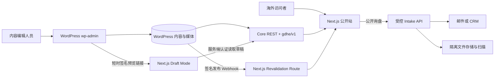
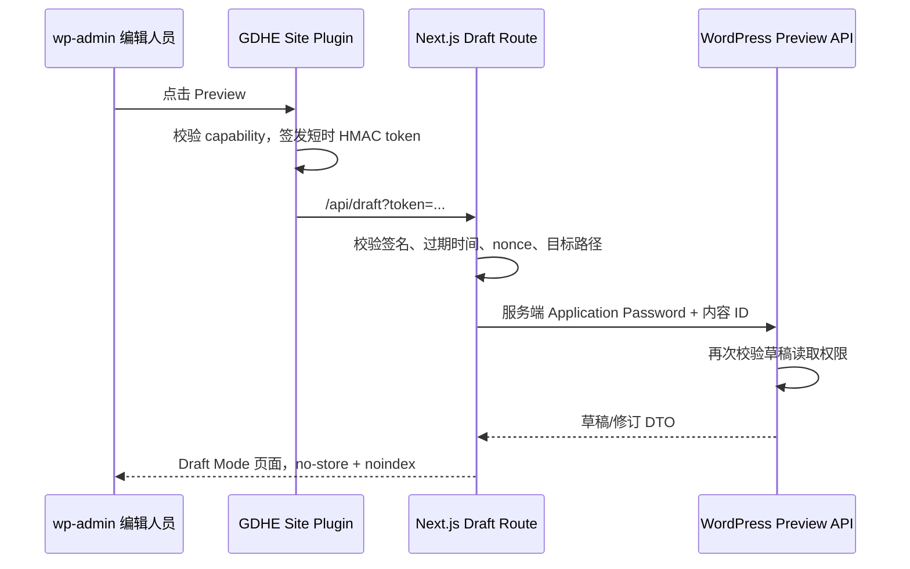

# GDHE Headless WordPress + Next.js 架构契约

status: proposed-for-TASK-002-acceptance
date: 2026-07-22
scope: architecture-only
supersedes: `docs/reference-site-analysis.md` 中 WordPress + Elementor 的实施建议
authority: `PROJECT/CONSTRAINTS.md`、ADR-001、ADR-002、ADR-003 与本契约

## 0. 决策摘要

| 领域 | 决策 |
|---|---|
| 公开前端 | Next.js App Router + TypeScript；版本在初始化任务中重新核实并锁定当时稳定补丁版 |
| 内容后台 | 现有 WordPress；`wp-admin` 是唯一最终内容管理后台 |
| 页面渲染 | 已发布营销内容采用静态生成/ISR；搜索、预览和其他请求态页面动态渲染 |
| 数据 API | **REST-first 受控组合**：WordPress 核心 REST + GDHE 自有 `/gdhe/v1` 归一化端点；本阶段不采用 WPGraphQL |
| 内容模型 | CPT/Taxonomy 由 GDHE Site Plugin 以 PHP 注册；固定字段优先；有限、版本化的页面模块使用 ACF Pro |
| 多语言 | 推荐 Polylang Pro；九种语言分别对应独立 WordPress 内容实体和独立发布状态；禁用机器翻译发布流程 |
| SEO 编辑 | 推荐 Yoast SEO，编辑人员在 `wp-admin` 维护 SEO 数据 |
| SEO 输出 | Next.js 是公开 HTML 的唯一输出权威；生成 canonical、hreflang、OG、Schema、Sitemap、robots |
| 预览 | WordPress 生成短时签名预览链接；Next.js Draft Mode；草稿数据只经服务端认证读取 |
| 缓存刷新 | WordPress 发布事件发送 HMAC 签名 Webhook；Next.js 按内容、路径、语言和集合标签失效 |
| 媒体 | WordPress Media Library 只存公开营销媒体；Next.js 统一图片组件和严格远程域名白名单 |
| 询盘与 CAD | 通过独立受控 intake API 和隔离对象存储；机密文件不得进入公开 Media Library |
| 参考边界 | 复用 RapidDirect 的公开信息架构和体验模式，不复制其源码、主题、品牌资产或文案 |

这是一份实施契约，不是项目初始化结果。本任务不创建 `frontend/`，不安装 npm 或 WordPress 插件，也不修改数据库。

## 1. 证据快照与版本口径

### 1.1 本地只读现场

2026-07-22 只读核验结果：

- WordPress Core：`7.0.2`，与 WordPress.org 当前安全稳定版一致。
- PHP CLI：`8.3.32`。
- MySQL Server：`8.4.10`；当前数据库由服务器报告为 `gdhe`，项目命名仍记作 `GDHE`。
- WordPress 活跃插件：无；Akismet 与 Hello Dolly 均未启用。
- 活跃主题：Twenty Twenty-Five；公开站不会使用它渲染最终页面。
- Next.js 尚未初始化；官方文档在本次核验时处于 `16.2.x` 稳定线，精确补丁号须在初始化当天重新查询并锁定。

版本号会变化，因此本契约只冻结能力和边界，不把当前补丁号写成长期硬约束。

### 1.2 证据原则

- 核心能力优先采用 Next.js、WordPress、插件厂商和 Google Search 官方资料。
- 插件价格、兼容版本、许可证、部署平台能力均属于时间敏感信息，进入安装任务前必须重新核实。
- RapidDirect 研究是视觉和信息架构证据，不是我方技术实现事实源。

## 2. 系统边界



### 2.1 责任矩阵

| 能力 | WordPress / `wp-admin` | Next.js | 外部/基础设施 |
|---|---|---|---|
| 内容、译文、媒体、发布状态 | 唯一权威 | 只读消费 | — |
| 页面布局和组件代码 | 保存结构化模块数据 | 唯一渲染权威 | — |
| URL 解析与语言切换映射 | 提供已发布路由和译文关系 | 规范化、路由和输出 | CDN 仅缓存 |
| SEO 文案 | 编辑与存储 | 生成最终标签和 JSON-LD | 搜索引擎消费 |
| 草稿预览 | 发起、鉴权、提供草稿 | Draft Mode 渲染 | — |
| 缓存失效 | 发送签名事件 | 校验并失效缓存 | 多实例时共享标签状态 |
| 公开表单 | 可保存将来的内部线索记录，但不是上传通道 | 表单 UI 与 BFF 入口 | 邮件/CRM、对象存储、扫描 |
| 用户账号 | WordPress 编辑账号 | 无公开客户账号 | 身份服务仅在未来需求中引入 |

不可形成第二套内容后台或第二份内容数据库。前端不得通过 Elementor、主题模板或 WordPress 页面 HTML 来决定最终公共布局。

## 3. 前端契约

### 3.1 路由模式

公开内容使用单一、可解析的 catch-all 内容入口，固定系统路由优先：

```text
src/app/
├── [[...segments]]/page.tsx       # 已发布 CMS 内容解析
├── search/page.tsx                # 动态搜索
├── api/draft/route.ts             # 开启预览
├── api/draft/disable/route.ts      # 退出预览
├── api/revalidate/route.ts        # 发布 Webhook
├── sitemap.ts                     # 公开路由清单
├── robots.ts
├── not-found.tsx
└── error.tsx
```

以上只是下一任务的目录输入，本任务不创建这些文件。

路由解析规则：

1. 如果首段是八个非英语 locale 之一，则该段决定语言；否则使用英语。
2. 英语不允许公开 `/en/` 副本；命中时永久重定向到无前缀 URL。
3. `zh-CN` 保留已确认大小写；错误大小写只重定向到唯一规范形式。
4. 内容 slug 可按语言独立维护；每个译文拥有自己的完整 `publicPath`。
5. 公共内容 URL 使用尾斜杠；大小写、重复斜杠和无尾斜杠变体一次永久归一。
6. 路由解析不到内容、译文未发布或类型不匹配时返回真实 404，不回退首页。

### 3.2 渲染策略

| 页面/请求 | 策略 | 初始兜底刷新 | 说明 |
|---|---|---:|---|
| 首页、About、Contact 壳层 | ISR | 24 小时 | 发布 Webhook 为主，时间刷新防止事件丢失 |
| Service、Industry、Material、Finish、Case、Blog 详情 | ISR | 24 小时 | 首批关键页可构建时生成，其余首次访问生成 |
| 服务/行业/资料库/博客列表与分页 | ISR | 1 小时 | 发布、撤回、分类变化时同时失效集合标签 |
| 站内搜索 | 动态 SSR / `no-store` | 不缓存个性化查询 | 查询参数不生成 canonical 内容页 |
| 草稿预览 | 动态 / `no-store` | 无 | 必须处于 Draft Mode 且服务端认证 |
| 表单 POST | 动态 Route Handler/BFF | 无 | 与内容渲染缓存完全隔离 |
| 404 | 动态解析后稳定 404 | — | `noindex`；不得 200 soft-404 |

当 WordPress 在 ISR 刷新时暂时不可用，保留最后一次成功生成的页面并记录错误；新部署在构建期无法取得必需内容时应失败，不用空内容覆盖线上版本。

### 3.3 Server / Client 边界

- 页面、布局、CMS 请求、Metadata 和 JSON-LD 默认使用 Server Components。
- Mega Menu、移动导航、Tabs、Accordion、Carousel、文件选择等确需状态或浏览器 API 的小组件才使用 Client Components。
- CMS 地址、预览凭据、Webhook Secret 和 API 凭据仅存在于 server-only 数据层，禁止进入 `NEXT_PUBLIC_*`。
- 组件只消费归一化 DTO，不直接依赖 WordPress、ACF、Polylang 或 Yoast 的原始响应形状。

### 3.4 建议模块边界

```text
src/
├── app/                         # 路由和 Metadata 文件
├── components/
│   ├── layout/                  # Header、Mega Menu、Footer、LanguageSwitcher
│   ├── modules/                 # CMS 可编排内容模块
│   ├── templates/               # 页面类型组合
│   └── ui/                      # Button、Card、Image、Tabs、Accordion 等
├── lib/
│   ├── cms/                     # client、adapter、schemas、cache tags
│   ├── i18n/                    # locale、路径、dir、语言切换
│   ├── seo/                     # metadata、hreflang、JSON-LD、sitemap
│   ├── inquiry/                 # 后续表单 BFF 边界
│   └── security/                # 签名、重放保护、输入验证
└── types/                       # 公开 DTO 与模块判别联合
```

## 4. WordPress 内容模型

### 4.1 注册方式

- CPT、Taxonomy、REST 端点、权限和发布 Hook 必须由 `gdhe-site` 自有插件注册。
- 不在主题、WordPress Core 或第三方插件中写项目逻辑。
- 不使用只存数据库、无法审查的 CPT UI 配置作为生产事实源。
- 所有公共 CPT 设置 `show_in_rest => true`；非公开内部类型通过自有端点和 capability 控制。

### 4.2 内容类型

| 类型 | WordPress 实体 | 核心内容 | 主要关系 |
|---|---|---|---|
| 通用页面 | 原生 `page` | 首页、About、Contact、法律页、活动落地页 | 模块、CTA、相关内容 |
| 服务 | `service` CPT | 能力说明、规格、公差、工艺、FAQ | Materials、Finishes、Industries、Cases |
| 行业 | `industry` CPT | 行业痛点、开发阶段、应用 | Services、Materials、Finishes、Cases |
| 材料 | `material` CPT | 性能、适用工艺、规格、应用 | Services、Finishes、Cases |
| 表面处理（Surface Finishes） | `surface_finish` CPT | 描述、适用材料/工艺、参数 | Materials、Services、Cases |
| 案例 | `case_study` CPT | 挑战、方案、过程、结果、获授权媒体 | Services、Industries、Materials |
| 客户评价（Testimonials） | `testimonial` CPT | 引语、姓名/职务、来源和使用授权 | 可选关联 Service/Case |
| 博客 | 原生 `post` | 长文、作者、分类、日期、封面 | Services、Materials、Cases |
| 每语言站点设置 | 非公开 `site_settings` CPT | Header CTA、Footer、联系信息、社交链接 | Polylang 译文组 |

建议 Taxonomy：

- `service_family`：Machining、Molding、Fabrication、3D Printing 等。
- `manufacturing_process`：材料/处理可适用的工艺。
- `material_family`：Metal、Plastic、Composite 等。
- `finish_family`：Coating、Plating、Mechanical、Heat Treatment 等。
- 博客继续使用原生 Category/Tag；只有真实筛选需求出现时才增加新 taxonomy。

### 4.3 共享字段

所有可路由内容至少提供：

- `schema_version`
- `template_key`
- `locale` 与不可变的 `translation_group_id`（由 GDHE Site Plugin 持久化，多语言适配层只读取和校验）
- 标题、slug、摘要、发布/修改时间、作者（适用时）
- Hero：eyebrow、H1、lead、媒体、主/次 CTA
- 内容模块 `modules[]`
- 关系字段：相关 Services、Industries、Materials、Finishes、Cases、Posts
- SEO 编辑数据：标题、描述、OG 图、robots 覆盖
- Breadcrumb 所需父级或 Hub 关系
- 内容所有者、来源/授权说明（案例、评价和媒体适用）

正文原则：

- 博客长文使用受控的原生 Block Editor 内容，前端只支持已列入测试清单的块和安全 HTML。
- 营销页、服务页和资料页使用结构化字段/模块，不把整页 Elementor HTML、任意短代码或内联脚本作为 API 内容。
- 规格表、FAQ、步骤、评价等使用结构化数组，不能塞进一个不可验证的 WYSIWYG 字段。

### 4.4 有限页面模块

首期允许的模块类型：

`hero`、`stats`、`card_grid`、`split_media`、`logo_strip`、`process_steps`、`tabs`、`accordion`、`testimonial_slider`、`resource_cards`、`data_table`、`cta_banner`、`rich_text`。

每个模块必须有稳定 `type`、`id`、`schemaVersion` 和明确字段；禁止在 `wp-admin` 直接输入 CSS、JavaScript、任意类名或组件路径。增加/删除模块类型属于代码和契约变更，不是普通内容编辑。

### 4.5 ACF / ACF Pro 决策

目标方案推荐 **ACF Pro**，因为已确认的信息架构需要重复字段、有限页面模块、图集与可复用字段组，分别对应 Repeater、Flexible Content、Gallery、Clone 类能力。正式采购/安装前仍须用最小字段矩阵证明至少一项 Pro 能力确实被使用，并通过 autosave、revision、preview 与 Local JSON 同步 PoC。约束如下：

- 固定业务字段优先使用固定 Field Group；Flexible Content 仅用于上述有限模块，不做无限页面生成器。
- CPT/Taxonomy 仍由自有 PHP 注册，ACF 只负责字段编辑体验。
- Field Group 启用 REST 时只暴露前端需要的字段。
- ACF Local JSON 存放在未来 `gdhe-site/acf-json/` 并进入 Git；生产禁止直接产生未同步的字段漂移。
- 字段删除/改名需要迁移脚本、回滚说明和 schema version，不允许静默破坏旧内容。
- ACF Pro 是商业许可证，许可证密钥不得入库；购买前不安装。

无商业许可证的可行替代是：原生注册 meta + Block Editor + 自有管理 UI，或 ACF Free 的固定字段。它可实现核心能力，但会增加 Repeaters/模块编辑和验证开发量，不能被描述为零成本等价替换。

## 5. API 契约

### 5.1 REST 与 WPGraphQL 结论

| 评估项 | WordPress REST | WPGraphQL |
|---|---|---|
| WordPress Core 内建 | 是 | 否，需要插件 |
| Polylang 官方语言/译文响应 | Pro 直接支持 | 需要另一层集成或自定义解析 |
| Yoast 官方 Headless API | 直接提供 REST JSON | 需要额外 GraphQL 适配 |
| ACF | 官方 REST opt-in | 需要 WPGraphQL for ACF |
| 深层关系一次查询 | 需归一化端点 | 强项 |
| 缓存与发布事件映射 | 资源/路径语义直接 | 需维护查询与实体依赖映射 |
| 当前项目复杂度 | 足够且依赖更少 | 现阶段收益不足以抵消插件链 |

frontend 与 wordpress_cms Lane 均提出了“WPGraphQL 主读取 + REST 窄用途”的有力备选，理由是深层关系、字段选择和类型生成；localization_seo Lane 则指出它会把多语言方案推向 WPML GraphQL，并增加 ACF、多语言与 SEO 扩展的兼容链。本契约没有忽略该分歧，完整裁决见 `TASKS/ARTIFACTS/TASK-002/EVIDENCE_SYNTHESIS.md`。

**决定：**首期采用 WordPress REST，不安装 WPGraphQL。当前已有 Core REST、Polylang Pro、Yoast 与 ACF 的厂商 REST 路径，而尚无代表页面 fixture 或性能数据证明 GraphQL 插件链具有净收益。数据访问层保留 adapter 边界；只有在真实页面查询出现无法通过批量 REST、`_fields`、`_embed` 或有限 `/gdhe/v1` 合理解决的可测瓶颈，或业务明确需要 WPML GraphQL 工作流时，才用新 ADR 重新评估 WPGraphQL。不得在组件中临时混入第二套数据协议。

下一阶段的 API fixture 任务必须用首页、Service 详情、Case 详情和 Material 详情四个代表页面建立同一组 REST 与候选 GraphQL 基准。测试从与 CMS 同部署区域运行，保留 WordPress 正常 object cache、绕过 Next.js 数据缓存；每个 fixture 预热后测量 200 次、并发 20。以下任一条件成立即**强制启动 GraphQL PoC 和新 ADR**，而不是直接在生产引入：

- 四个 fixture 中至少两个在聚合后仍需要超过 2 个串行 CMS origin 请求；
- 任一 fixture 的 CMS 数据获取 p95 超过 500 ms，或上游错误率超过 1%；
- 四个 fixture 中至少两个在使用 `_fields` 和归一化后单页 JSON 仍超过 250 KB；
- 自有只读聚合增长为超过 5 个端点，或出现 3 个及以上模板专属查询图。

这些数值是协议比较门，不是尚未验证的生产 SLA。只有 WPGraphQL 对同一 fixture 显著改善触发指标，且 ACF、多语言、SEO、预览、权限和许可证 PoC 同时通过，才可用新 ADR 替换 REST-first。

### 5.2 端点层级

1. 核心 `/wp-json/wp/v2/*`
   - 简单 CPT/Taxonomy 集合、媒体、作者等标准资源。
   - 通过 `_fields` 限制响应，避免前端取得无关字段。
2. Polylang Pro REST
   - `lang` 筛选、`lang`/`translations` 响应字段、语言清单。
3. Yoast REST
   - 读取 `yoast_head_json` 的编辑结果；不使用其只读 API写数据。
4. GDHE `/wp-json/gdhe/v1/*`
   - `GET /resolve?locale=&path=`：将公开路径解析为归一化内容。
   - `GET /collection/{type}?locale=&page=&filters=`：稳定分页和筛选。
   - `GET /navigation?locale=`：规范化当前语言的 Header/Mega Menu/Footer。
   - `GET /route-manifest`：只返回已发布公共路径、修改时间和译文闭包。
   - `GET /preview/{id}`：仅认证服务账号可读草稿/修订。

公共端点只返回 `publish` 内容。草稿、私有内容、内部备注、用户邮件、插件配置和原始机密 meta 不得出现在匿名响应。

### 5.3 归一化 DTO 示例

```ts
type Locale = 'en' | 'fr' | 'de' | 'es' | 'zh-CN' | 'ar' | 'hi' | 'ja' | 'pt'

interface MediaReference {
  attachmentId: number
  url: string
  mimeType: string
  width: number
  height: number
  alt: string
  caption?: string
  decorative: boolean
}

interface ContentEnvelope {
  schemaVersion: '1.0'
  id: number
  type: 'page' | 'service' | 'industry' | 'material' | 'surface_finish' | 'case_study' | 'post'
  templateKey: string
  locale: Locale
  translationGroupId: string
  publicPath: string
  title: string
  excerpt?: string
  publishedAt: string
  modifiedAt: string
  featuredMedia?: MediaReference
  hero?: HeroModule
  modules: ContentModule[]
  relations: Record<string, ContentReference[]>
  translations: Partial<Record<Locale, { publicPath: string }>>
  seo: SeoDocument
}
```

这只是契约示例，不代表已创建 TypeScript 代码。PHP 端点的 JSON Schema、TypeScript 类型和代表性 fixture 必须在下一任务中做契约测试。

### 5.4 错误和版本边界

| HTTP | 语义 |
|---:|---|
| 400 | locale、path、筛选或 schema 参数非法 |
| 401 | 未提供或无效的预览身份 |
| 403 | 身份存在但无查看该草稿的 capability |
| 404 | 路由不存在、内容未发布或译文不可公开 |
| 409 | 路由/译文关系冲突，主要用于受控管理接口 |
| 429 | 超出速率限制 |
| 502/503 | CMS 或下游服务暂时不可用；前端应保留最后成功缓存 |

- `/gdhe/v1` 保持向后兼容；破坏性响应变化进入 `/gdhe/v2`。
- 响应提供 `schemaVersion`、`Last-Modified`/ETag（适用时）和可追踪 request ID。
- 前端在边界做运行时校验；遇到未知必需模块或不兼容 schema 时记录错误并让该页失败到受控错误态，不能悄悄渲染错误内容。

## 6. 九语言发布契约

| 内容语言 | 公共前缀 | HTML `lang` | 方向 |
|---|---|---|---|
| 英语 | `/` | `en` | LTR |
| 法语 | `/fr/` | `fr` | LTR |
| 德语 | `/de/` | `de` | LTR |
| 西班牙语 | `/es/` | `es` | LTR |
| 简体中文 | `/zh-CN/` | `zh-CN` | LTR |
| 阿拉伯语 | `/ar/` | `ar` | RTL |
| 印地语 | `/hi/` | `hi` | LTR |
| 日语 | `/ja/` | `ja` | LTR |
| 葡萄牙语 | `/pt/` | `pt` | LTR |

### 6.1 插件与编辑流程

| 候选 | 适配点 | 主要成本 | 结论 |
|---|---|---|---|
| Polylang Pro | 官方 REST 语言/译文能力、语言权限、CPT/Taxonomy、菜单与 ACF Pro 集成 | 商业许可；需验证九语言发布、字段规则和 REST 输出 | **REST-first 首选** |
| WPML Multilingual CMS + WPML GraphQL | 翻译面板、语言对、角色和官方 GraphQL 扩展完整 | 商业套件与多个扩展；更大的兼容、升级和预览 PoC 面 | WPGraphQL-first 时的主要备选 |
| MultilingualPress | 每语言独立站 | 依赖 Multisite，九站运维与 API 聚合复杂 | 不选 |
| 自研关系模型 | 完全控制 | 需自建编辑 UI、权限、迁移和长期维护 | 当前不选 |

推荐 **Polylang Pro**：它与已裁决的 REST-first 边界直接匹配，并由厂商提供语言筛选、译文 ID 映射和语言端点。它是年度商业许可证，采购前必须重新核实价格、兼容版本，并用 English/French/Arabic 的 Service fixture 验证独立发布、撤回、字段翻译、权限与 REST 响应。Polylang 与 WPML 不得并装；若未来必须采用 WPML 的翻译任务编排，应同时用新 ADR 复核 API 方向。

稳定译文组 ID 不依赖 Polylang 未承诺的内部结构，也不使用会随内容变化的最小 post ID。GDHE Site Plugin 注册受保护 meta `_gdhe_translation_group_uuid`：

- 首个语言实体创建时生成 UUID v4；创建或关联 sibling 时复制同一值；匿名 Core REST 不直接暴露该 meta。
- `/gdhe/v1` 只在所有 Polylang sibling 拥有同一 UUID 且 locale 唯一时返回 `translationGroupId`；不一致时 fail closed 并记录治理错误。
- 删除英语源文不改变其他 sibling 的 UUID；拆组、合组或重连必须由有权限的显式迁移操作完成，同时失效旧组、新组、路由、hreflang 和 Sitemap。
- 既有内容迁移时一次性生成并持久化 UUID；前端不得从 slug、标题、URL 或当前 sibling 集合计算组 ID。

编辑流程：

1. 英语是源文，先创建并完成基本字段。
2. 目标语言通过 Polylang 创建为独立 post，不与英语共享 `post_status`。
3. 初始复制仅用于建立结构；译文文本、slug、SEO、OG 图和关系均可独立编辑。
4. 译文由 Draft → Pending Review → Publish 独立推进；没有自动发布联动。
5. 不配置 DeepL 或其他机器翻译服务；机器翻译不是项目正式流程。
6. 英语更新不会自动覆盖已发布译文；编辑界面应提示译文可能过期，但是否重新发布由人工决定。

ACF 翻译行为初始规则：

- 文本与模块子字段使用独立翻译或 Translate Once，避免源文后续覆盖译文。
- 图片的 attachment ID 可 Copy Once 作为译文起点；同一媒体引用内的 `alt`、caption 和 decorative 标记使用 Translate Once，并由目标语言编辑人员独立复核。编辑人员之后可以按语言替换 attachment ID。
- 数字和不可变内部 ID 可 Copy Once；除明确不可变技术值外不持续同步。
- 除明确的不可变技术值外，不使用持续 Synchronize。
- 关系字段优先映射到目标语言已发布实体；目标关系不存在时为空并提示，而不是链接回英语内容。

### 6.2 语言切换

- API 返回当前翻译组中**已发布**版本的 `locale → publicPath` 映射。
- 切换器只显示可公开译文；缺失/草稿译文默认隐藏，不显示会跳首页的假链接。
- 当前语言始终有自链接状态；阿拉伯语切换后 `<html dir="rtl">`。
- 不根据 IP 或 `Accept-Language` 强制重定向。未来可以提供非阻断语言建议，但不得改变爬虫 canonical。
- 直接访问未发布译文返回 404；从 Sitemap、hreflang、语言切换和站内搜索全部排除。

### 6.3 RTL

- 用 CSS logical properties（如 inline/block start/end），不能把 left/right 写死为布局语义。
- 图标箭头、步骤方向、Carousel、面包屑、表格滚动和 Mega Menu 展开方向逐组件验证。
- 电话、邮箱、代码、尺寸和文件名等局部 LTR 内容使用明确 `dir` 隔离。
- 1440、1024、768、390 px 均用真实阿拉伯语内容验收，不只切换 `dir` 属性。

## 7. SEO 契约

### 7.1 权威边界

- Yoast SEO 提供 `wp-admin` 编辑、SEO/可读性提示和 REST 中的 `yoast_head_json`。
- Next.js 不直接注入 Yoast 的 `yoast_head` HTML blob，以免输出 CMS 域名、重复标签或未经验证的脚本。
- Next.js 从归一化 `SeoDocument` 生成最终 Metadata；canonical、公开 URL、hreflang 和 Schema 必须以公开站域名为准。
- 公开 HTML 只能有一套 canonical、robots、OG 和 JSON-LD 输出权威。

Yoast Free 足以作为首期候选；Premium 只有在重定向管理、内部链接等具体收益被确认后才采购，不能因“参考站使用”自动购买。

### 7.2 每页输出

- 唯一 Title、Meta Description、单一 H1。
- 自引用 canonical；各语言不 canonical 到英语。
- Open Graph（OG）/Twitter 标题、描述、图片和 locale。
- 可见 Breadcrumb 与 `BreadcrumbList` 保持一致。
- `html lang` 与阿拉伯语 `dir`。
- 索引策略：公开已发布页面默认 `index,follow`；预览、搜索结果、Staging 和内部页面 `noindex`。

### 7.3 hreflang

- 每个已发布译文页面输出相同的、双向闭合的 alternate 集合，包含自身。
- `x-default` 指向该翻译组的英语 URL；英语是已确认的默认和源语言。
- 只输出已发布译文；不为缺失语言构造 URL。
- 使用完整绝对 HTTPS URL；`zh-CN` 保留地区代码，其余使用已确认通用语言代码。
- HTML head 是首要实现；Sitemap 可以同时携带语言 alternates，但必须由同一 route manifest 生成，避免两套数据源。

### 7.4 Schema

| 模板 | JSON-LD |
|---|---|
| 全站/首页 | `Organization`、`WebSite` |
| 所有层级页 | `BreadcrumbList` |
| 服务/行业 | `Service` + 对应 `WebPage` |
| 博客 | `Article`、`Person`、`ImageObject` |
| 案例 | `Article` 或 `CreativeWork`，按实际内容选择 |
| 材料/表面处理 | `WebPage`；只有真实满足定义时再增加专业类型 |

- 不输出虚构评分、不可见 FAQ、伪造价格或未经核验的认证。
- `Product`、`AggregateRating`、`Review` 只有业务语义和页面可见证据都成立时才能使用。
- FAQ 内容可以保留语义化 HTML；是否输出 `FAQPage` 在实施时依据当时搜索政策重新验证。

### 7.5 Sitemap、robots 与 URL 生命周期

- Next.js 根据 `route-manifest` 生成公开 Sitemap，只包含 canonical、已发布、可索引 URL。
- 可按内容类型拆分 Sitemap；规模未达到阈值前不做无意义分片。
- `robots.txt` 指向公开 Sitemap；Staging 使用身份保护和 `noindex`，不能只依赖 robots 阻止索引。
- slug 改名或迁移必须记录旧路径并产生单跳永久重定向。
- 撤回页面从 Sitemap/hreflang 移除并返回 404；只有明确永久删除策略时使用 410。

## 8. 预览契约



安全要求：

- Token 有内容 ID、locale、目标路径、签发/过期时间和一次性 nonce，建议有效期不超过 5 分钟。
- WordPress Application Password 绑定最小权限技术账号，只经 HTTPS 和服务端使用，可单独撤销。
- 预览 URL 不携带 WordPress 用户密码，不把认证信息写入日志、Analytics 或 Referer。
- Draft Mode cookie 为 HttpOnly、Secure、SameSite；提供明确退出预览入口。
- 预览响应 `private, no-store` 并 `noindex`；任何 CDN 不得缓存。

## 9. 发布 Webhook 与缓存

### 9.1 事件

以下变化触发失效事件：发布、更新、撤回、删除、slug/父级变更、译文关系变更、Taxonomy/关系字段变更、菜单和站点设置变更。

示例负载：

```json
{
  "eventId": "uuid",
  "event": "content.published",
  "occurredAt": "2026-07-22T00:00:00Z",
  "content": { "id": 123, "type": "service", "locale": "de" },
  "translationGroupId": "2d4f3e7e-5ae0-4a7d-a796-1e2bd0cb5b67",
  "oldPath": "/de/alter-slug/",
  "newPath": "/de/neuer-slug/",
  "tags": ["content:service:123", "collection:service:de", "translation:2d4f3e7e-5ae0-4a7d-a796-1e2bd0cb5b67"]
}
```

HTTP Header 包含 key ID、时间戳和请求体 HMAC。Next.js 校验时间窗口、常量时间签名和 `eventId` 重放记录后，才调用缓存 API。

### 9.2 标签

| 标签 | 用途 |
|---|---|
| `content:{type}:{id}` | 当前内容数据 |
| `route:{locale}:{pathHash}` | 当前公开路径 |
| `translation:{groupId}` | 全部语言映射与 hreflang |
| `collection:{type}:{locale}` | 列表、分页和筛选 |
| `nav:{locale}` | Header/Mega Menu/Footer 导航 |
| `settings:{locale}` | 当前语言全局设置 |
| `sitemap` | route manifest 与 Sitemap |

外部 Webhook 需要内容立即过期时，按当前 Next.js 官方契约使用 `revalidateTag(tag, { expire: 0 })`，并对旧/新 path 使用 `revalidatePath`；具体 API 在初始化时按锁定版本复核。

### 9.3 可靠性

- WordPress 记录发送结果、状态码、重试次数和 request ID；失败采用有上限的退避重试。
- Webhook 处理必须幂等；相同 `eventId` 重复到达不产生异常。
- 24 小时/1 小时 ISR 时间窗是事件丢失的最终兜底，不替代告警。
- 多实例自托管时使用共享 cache/tag 协调；否则一个实例失效而其他实例继续返回旧内容。
- 若前置 CDN 单独缓存 HTML，必须同步 purge；首期优先只使用部署平台/Next.js 的单一 HTML 缓存权威。

## 10. 媒体契约

- WordPress Media Library 只存可公开的品牌、工厂、服务、案例和文章媒体。首期明确保持 **Polylang Media module 关闭**，并在首批内容/媒体导入前冻结该设置；不依赖翻译 attachment，也不在内容建立后静默切换模块。
- attachment 只作为二进制、MIME、宽高、尺寸、credit 和授权信息的事实源。WordPress attachment 的全局 `alt_text` 只可作为编辑提示，不能直接成为公开多语言 alt 的 fallback。
- 每次公开媒体使用都保存于当前语言内容实体的结构化 `MediaReference`：attachment ID、`alt`、caption、decorative。它是**唯一**本地化模型，不再同时维护 attachment sibling 方案。
- ACF Image/Gallery 关系的 attachment ID 可 Copy Once 作为初始选择；`alt` 与 caption 子字段 Translate Once。目标译文发布前必须人工复核，源文更新不得覆盖它们。
- 非装饰图必须有当前语言、当前上下文的非空 `alt`；装饰图必须 `decorative=true` 且 `alt=""`。必需字段不满足时阻止发布；已存在的异常公开数据由 API schema fail closed，不能回退英语 alt、文件名或 attachment 全局 alt。
- 如果图片内含文字或市场内容，目标语言内容实体直接选择另一 attachment；不要求两个物理文件建立 Polylang 媒体译文关系。
- API 用当前内容引用与 attachment 二进制元数据组合返回 `MediaReference`。同一 attachment 在不同页面、语言或上下文可拥有不同 alt，这是设计目标而非重复数据错误。
- Next.js 公共图片组件统一处理比例、`sizes`、优先级、懒加载和错误占位；远程图片仅允许精确 HTTPS 主机/路径模式。
- 视频使用封面和延迟加载；大视频优先外部流媒体/CDN，WordPress 只存元数据和授权封面。
- 图片生成 WebP/AVIF 的具体链路在部署任务决定；不得同时堆叠多个互相改写 URL 的图片插件。
- 机密 CAD、报价附件、客户图纸和含个人数据的文件不得进入 Media Library，也不得取得公开 URL。

## 11. 询盘、文件、邮件与 CRM 边界

本任务不实现询盘系统，只冻结边界：

1. 浏览器向同源 Next.js intake Route Handler 提交表单，不直接 POST WordPress 公共 REST。
2. 文本字段做 schema 校验、长度限制、反垃圾、速率限制、Origin/CSRF 防护和隐私同意记录。
3. 文件先取得短时预签名上传地址，写入隔离对象存储的 quarantine 区。
4. 服务端校验扩展名、MIME、文件签名和大小，重命名对象并执行病毒/沙箱扫描；扫描通过后才可供内部人员访问。
5. 邮件/CRM 通知异步发送；失败可重试，不能让浏览器假成功。
6. 如需在 `wp-admin` 查看线索，可在后续任务创建非公开 `gdhe_inquiry` 类型，只保存最小化元数据、处理状态和短时签名文件引用；文件本体仍在隔离存储。
7. 保留期限、允许格式/容量、CRM、邮件和扫描供应商均需要单独业务确认。

## 12. 安全、权限与隐私

- 编辑角色按最小权限划分：Administrator 管系统；Editor/语言编辑只管理获授权内容和语言。
- Polylang 语言 capability 用于限制编辑人员的语言范围；机器翻译 capability 不授予。
- 匿名 API 只读已发布字段；预览端点用 `current_user_can`/等效 capability，而不是只检查“已登录”。
- 所有 WordPress 输入先验证再清理，输出按上下文延迟转义；富文本使用明确 HTML allowlist。
- Preview、Webhook、Intake 使用不同 secret 和撤销机制；所有 secret 通过环境变量/主机 secret store 管理。
- CMS、Staging 和 Production 使用独立数据库、密钥和域名；备份加密并定期恢复演练。
- `wp-admin` 强制 HTTPS、2FA、最小账号、更新策略和 WAF；XML-RPC 等不需要入口按验证结果关闭或限制。
- 日志不得记录密码、Application Password、HMAC、完整 CAD URL 或敏感表单正文；request ID 用于关联。

## 13. 部署形态

建议域名边界：

```text
www.example.com        Next.js 公开站
cms.example.com        WordPress / wp-admin / 受控 REST
assets.example.com     可选公开媒体 CDN
uploads.example.com    私有上传服务，不公开列目录
```

实际域名和部署商未确认，不写死在代码契约。无论选择托管平台还是自托管：

- 必须支持 App Router、SSR、ISR、Draft Mode、Route Handlers 和按需失效，不能使用纯静态导出。
- 多实例部署必须有共享缓存和 tag 协调，或选择原生提供这一能力的平台。
- WordPress 与公开站可以独立发布和回滚；API schema 先向后兼容，再发布前端消费者。
- Staging 使用单独 CMS/数据快照、身份保护和 `noindex`；不能连接生产编辑库做破坏性测试。
- 健康检查至少覆盖前端、CMS REST、Webhook 最近成功时间和预览链路。

## 14. 后续实施顺序

TASK-002 验收后，建议依次创建独立任务：

1. **基础初始化任务**：重新核实稳定版本和许可证，初始化 Next.js + TypeScript；建立环境变量、lint/typecheck/test，不开发首页。
2. **CMS Schema 基础任务**：创建 `gdhe-site` 插件骨架，注册最小 CPT/Taxonomy、字段导出和只读 API；安装插件前备份并设回滚门。
3. **API/Fixture 契约任务**：实现 DTO、运行时 schema、代表页面 fixture 和 REST contract tests。
4. **全局壳层任务**：设计令牌、Header、Mega Menu、移动导航、Footer、图片组件、语言骨架。
5. **首页小批次任务**：每次 1～3 个模块，按 1440/1024/768/390 截图对照并等待确认。
6. **页面模板任务**：Services、Industries、Materials、Finishes、Cases、Blog、About、Contact。
7. **九语言/SEO 任务**：真实译文流程、RTL、Metadata、hreflang、Schema、Sitemap、robots、404。
8. **询盘任务**：只有在格式、容量、保留期、邮件/CRM、对象存储和隐私政策确认后实施。
9. **最终 QA**：性能、可访问性、安全、浏览器、发布/预览/缓存和恢复演练。

每项仍走独立 task-intake、需求确认、执行、验证、对抗审查和用户验收门。

## 15. 验收追踪

| TASK-002 验收要求 | 契约位置 |
|---|---|
| Next.js + TypeScript / WordPress `wp-admin` 边界 | 0、2、3 |
| REST / WPGraphQL 明确决策 | 5.1 |
| CPT、Taxonomy、共享字段 | 4 |
| ACF/ACF Pro、原生字段、导出与许可证 | 4.5 |
| 九语言、当前页切换、独立发布、缺失译文、RTL | 6 |
| ISR、预览、Webhook、缓存 | 3.2、8、9 |
| SEO、Schema、Sitemap、robots、canonical、OG | 7 |
| 媒体 | 10 |
| 询盘、上传、邮件/CRM | 11 |
| 权限、secret、速率限制、日志、恢复 | 8、9、11、12、13 |
| 建议目录、DTO 示例、后续顺序 | 3.4、5.3、14 |
| 本任务未初始化项目 | 0、16 |

## 16. 本任务未执行的事项

- 未创建 `frontend/` 或任何 Next.js/TypeScript 文件。
- 未运行 npm、pnpm、yarn、bun 或 `create-next-app`。
- 未安装或配置 Polylang、ACF、Yoast、WPGraphQL 或其他插件。
- 未修改 WordPress 数据库、用户、主题、页面、插件或 uploads。
- 未创建表单、上传服务、CRM、邮件或部署资源。
- 未提交、推送、合并或部署 Git 内容。

## 17. 不阻塞本契约但需后续确认

- 公开域名、CMS 域名、部署平台和 CDN。
- Polylang Pro 与 ACF Pro 的采购授权；Yoast Free/Premium 的最终版本。
- 包管理器和 Next.js 精确补丁版。
- 正式品牌资产、内容清单、编辑角色和翻译负责人。
- 邮件、CRM、对象存储、扫描服务、Cookie/Analytics 和数据保留政策。

这些选择不会改变本契约的系统边界；如果后续选择改变核心边界，必须新建 ADR。

## 18. 官方资料

访问日期均为 2026-07-22。

### Next.js

- [App Router](https://nextjs.org/docs/app)
- [Server and Client Components](https://nextjs.org/docs/app/getting-started/server-and-client-components)
- [Internationalization](https://nextjs.org/docs/app/guides/internationalization)
- [Incremental Static Regeneration](https://nextjs.org/docs/app/guides/incremental-static-regeneration)
- [Draft Mode](https://nextjs.org/docs/app/api-reference/functions/draft-mode)
- [revalidateTag](https://nextjs.org/docs/app/api-reference/functions/revalidateTag)
- [Metadata / Sitemap](https://nextjs.org/docs/app/api-reference/file-conventions/metadata/sitemap)
- [Image](https://nextjs.org/docs/app/api-reference/components/image)
- [Self-hosting](https://nextjs.org/docs/app/guides/self-hosting)

### WordPress 与字段层

- [WordPress 7.0.2 Release](https://wordpress.org/news/2026/07/wordpress-7-0-2-release/)
- [REST API Reference](https://developer.wordpress.org/rest-api/reference/)
- [REST support for custom content types](https://developer.wordpress.org/rest-api/extending-the-rest-api/adding-rest-api-support-for-custom-content-types/)
- [Adding custom endpoints](https://developer.wordpress.org/rest-api/extending-the-rest-api/adding-custom-endpoints/)
- [Modifying REST responses / registered meta](https://developer.wordpress.org/rest-api/extending-the-rest-api/modifying-responses/)
- [REST Authentication](https://developer.wordpress.org/rest-api/using-the-rest-api/authentication/)
- [WordPress Security](https://developer.wordpress.org/apis/security/)
- [ACF REST API integration](https://www.advancedcustomfields.com/resources/wp-rest-api-integration/)
- [ACF Local JSON](https://www.advancedcustomfields.com/resources/local-json/)
- [ACF Pro features and licensing](https://www.advancedcustomfields.com/pro/)

### 多语言与 SEO

- [Polylang Pro REST API](https://polylang.pro/documentation/support/developers/rest-api/)
- [Polylang Pro + ACF Pro](https://polylang.pro/documentation/support/guides/working-with-acf-pro/)
- [Polylang media translation choices](https://polylang.pro/documentation/support/guides/working-with-media/)
- [Polylang features and license](https://polylang.pro/pricing/)
- [WPML GraphQL](https://wpml.org/documentation/related-projects/wpml-graphql/)
- [WPML translation workflow](https://wpml.org/documentation/translating-your-contents/)
- [Yoast SEO REST API](https://developer.yoast.com/customization/apis/rest-api/)
- [Google: localized versions and hreflang](https://developers.google.com/search/docs/specialty/international/localized-versions)
- [Google: robots meta / X-Robots-Tag](https://developers.google.com/search/docs/crawling-indexing/robots-meta-tag)
- [Google: structured data guidelines](https://developers.google.com/search/docs/appearance/structured-data/sd-policies)
- [OWASP File Upload Cheat Sheet](https://cheatsheetseries.owasp.org/cheatsheets/File_Upload_Cheat_Sheet.html)
